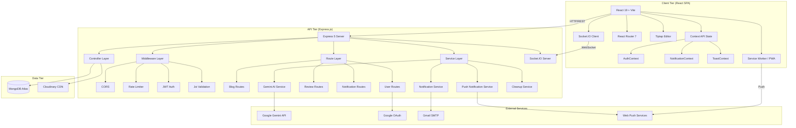
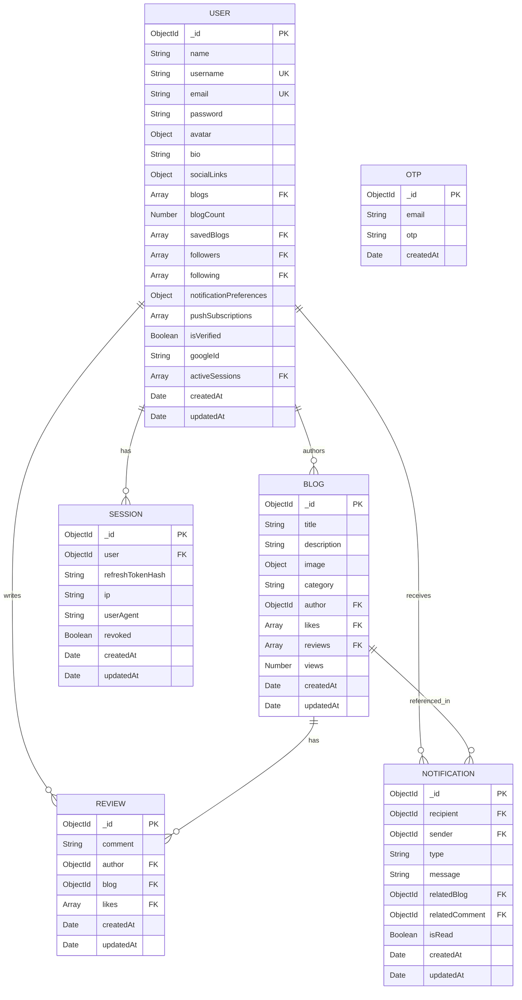
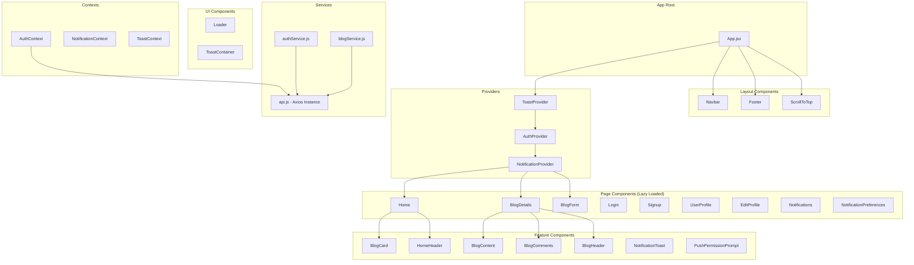
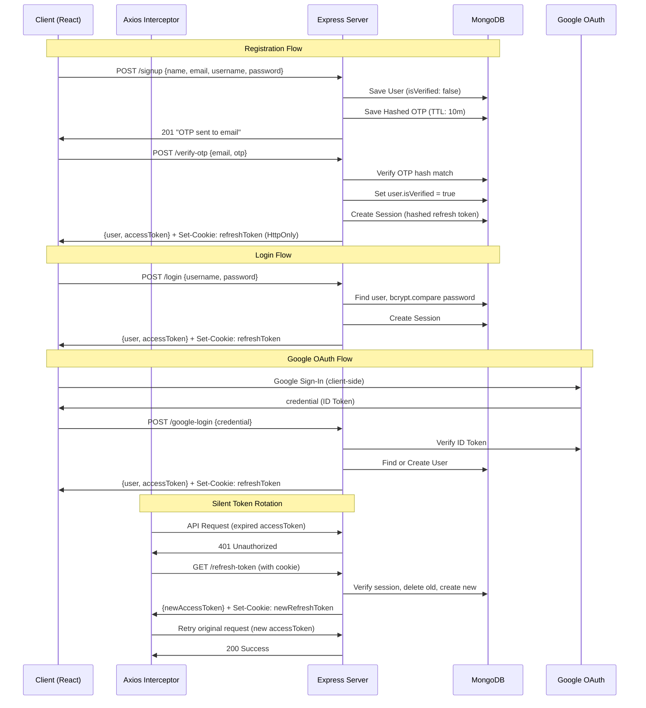
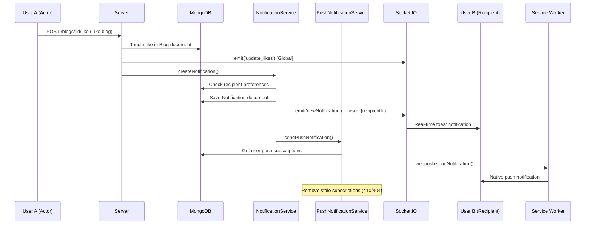
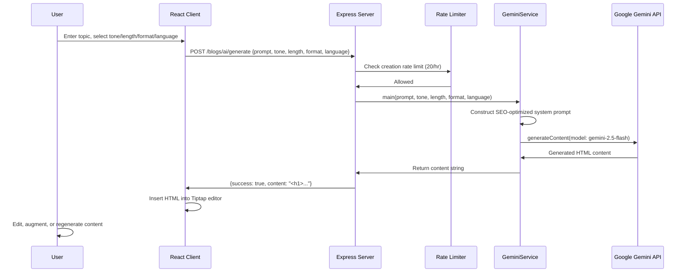
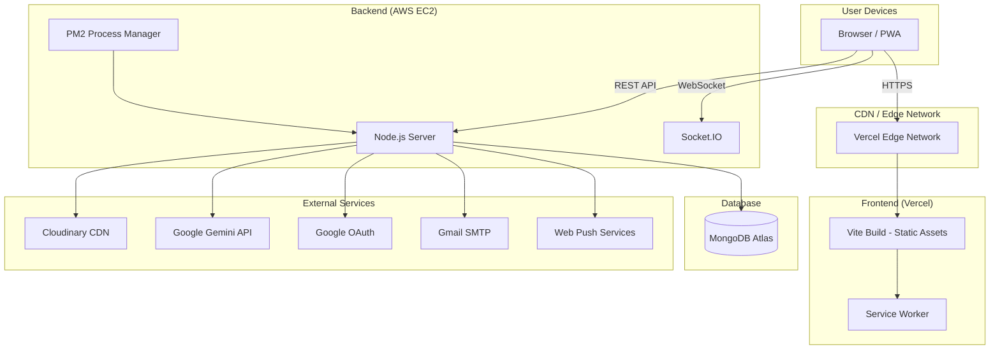
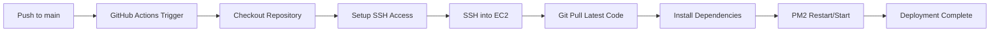

# RapidPost - Project Report

---

# COVER PAGE

---

<div align="center">

# RapidPost

## AI-Powered Blogging Platform with Real-Time Features

### Project Report

**Author:** Nimish Kumar

**Website:** [https://www.rapidpost.live](https://www.rapidpost.live)

**Repository:** [https://github.com/Nimishkumar07/RapidPost](https://github.com/Nimishkumar07/RapidPost)

**Technology:** MERN Stack (MongoDB, Express.js, React, Node.js)

**Date:** 2025

</div>

---

# ABSTRACT

RapidPost is a modern, full-stack blogging platform engineered using the MERN stack (MongoDB, Express.js, React, Node.js) that combines artificial intelligence, real-time communication, and progressive web application capabilities to deliver a next-generation content creation experience. The platform addresses critical gaps in existing blogging solutions by integrating AI-powered content generation via Google Gemini, native voice-to-text dictation through the Web Speech API, and bidirectional real-time updates using Socket.IO -- all within a single, cohesive application.

The system implements enterprise-grade security through a stateless JWT architecture featuring silent token rotation with a promise-queue-based Axios interceptor mechanism, SHA-256-hashed OTP email verification with MongoDB TTL auto-expiration, bcrypt password hashing with configurable salt rounds, Google OAuth 2.0 integration, and granular rate limiting across all API endpoints. The backend is built on Express 5 with a service-oriented architecture that cleanly separates concerns across controllers, services, models, and utility layers.

Key features include a rich-text Tiptap/ProseMirror editor with advanced formatting capabilities, multilingual content support across nine Indian languages, real-time social interactions (likes, comments, follows) broadcast through Socket.IO room-based architecture, native push notifications via the Web Push protocol with VAPID authentication, a comprehensive notification system with user preference controls, optimistic UI updates for instant feedback, smart server-side pagination, dynamic SEO-optimized XML sitemap generation, and full Progressive Web App (PWA) installability with offline reading support.

The frontend leverages React 19 with lazy-loaded route-based code splitting, Context API for global state management, and Bootstrap 5 for responsive design. The application is deployed with the frontend on Vercel and the backend on AWS EC2, managed by PM2 with automated CI/CD through GitHub Actions.

---

# TABLE OF CONTENTS

- [Chapter 1: Introduction](#chapter-1-introduction)
  - [1.1 Project Overview and Background](#11-project-overview-and-background)
  - [1.2 Problem Statement](#12-problem-statement)
  - [1.3 Objectives and Scope](#13-objectives-and-scope)
  - [1.4 Significance of the Project](#14-significance-of-the-project)
  - [1.5 Report Organization](#15-report-organization)
- [Chapter 2: Literature Review](#chapter-2-literature-review)
  - [2.1 Existing Blogging Platforms Analysis](#21-existing-blogging-platforms-analysis)
  - [2.2 MERN Stack Overview](#22-mern-stack-overview)
  - [2.3 AI in Content Generation](#23-ai-in-content-generation)
  - [2.4 Real-Time Web Applications](#24-real-time-web-applications)
  - [2.5 Progressive Web Applications](#25-progressive-web-applications)
- [Chapter 3: System Requirements](#chapter-3-system-requirements)
  - [3.1 Functional Requirements](#31-functional-requirements)
  - [3.2 Non-Functional Requirements](#32-non-functional-requirements)
  - [3.3 Hardware Requirements](#33-hardware-requirements)
  - [3.4 Software Requirements](#34-software-requirements)
  - [3.5 User Requirements](#35-user-requirements)
- [Chapter 4: System Design](#chapter-4-system-design)
  - [4.1 System Architecture](#41-system-architecture)
  - [4.2 Database Schema Design](#42-database-schema-design)
  - [4.3 API Design Documentation](#43-api-design-documentation)
  - [4.4 UI/UX Design Principles](#44-uiux-design-principles)
  - [4.5 Component Architecture](#45-component-architecture)
  - [4.6 Data Flow Diagrams](#46-data-flow-diagrams)
- [Chapter 5: Technology Stack](#chapter-5-technology-stack)
  - [5.1 Frontend Technologies](#51-frontend-technologies)
  - [5.2 Backend Technologies](#52-backend-technologies)
  - [5.3 Database](#53-database)
  - [5.4 Real-Time Communication](#54-real-time-communication)
  - [5.5 AI Integration](#55-ai-integration)
  - [5.6 Other Third-Party Services](#56-other-third-party-services)
- [Chapter 6: Implementation](#chapter-6-implementation)
  - [6.1 Project Structure](#61-project-structure)
  - [6.2 Authentication System](#62-authentication-system)
  - [6.3 Blog Management System](#63-blog-management-system)
  - [6.4 Real-Time Features Implementation](#64-real-time-features-implementation)
  - [6.5 AI Content Generation](#65-ai-content-generation)
  - [6.6 Push Notification System](#66-push-notification-system)
  - [6.7 Notification Lifecycle Management](#67-notification-lifecycle-management)
  - [6.8 Social Features](#68-social-features)
- [Chapter 7: Testing](#chapter-7-testing)
  - [7.1 Testing Methodology](#71-testing-methodology)
  - [7.2 Unit Testing Approach](#72-unit-testing-approach)
  - [7.3 Integration Testing](#73-integration-testing)
  - [7.4 Performance Testing](#74-performance-testing)
  - [7.5 User Acceptance Testing](#75-user-acceptance-testing)
  - [7.6 Test Cases and Results](#76-test-cases-and-results)
- [Chapter 8: Deployment](#chapter-8-deployment)
  - [8.1 Deployment Architecture](#81-deployment-architecture)
  - [8.2 Frontend Deployment (Vercel)](#82-frontend-deployment-vercel)
  - [8.3 Backend Deployment (AWS EC2)](#83-backend-deployment-aws-ec2)
  - [8.4 Database Setup (MongoDB Atlas)](#84-database-setup-mongodb-atlas)
  - [8.5 Environment Configuration](#85-environment-configuration)
  - [8.6 CI/CD Pipeline](#86-cicd-pipeline)
- [Chapter 9: Results and Discussion](#chapter-9-results-and-discussion)
  - [9.1 System Performance Metrics](#91-system-performance-metrics)
  - [9.2 User Feedback Analysis](#92-user-feedback-analysis)
  - [9.3 Feature Comparison with Competitors](#93-feature-comparison-with-competitors)
  - [9.4 Achievements vs Objectives](#94-achievements-vs-objectives)
- [Chapter 10: Conclusion and Future Scope](#chapter-10-conclusion-and-future-scope)
  - [10.1 Project Summary](#101-project-summary)
  - [10.2 Key Achievements](#102-key-achievements)
  - [10.3 Limitations](#103-limitations)
  - [10.4 Future Enhancements](#104-future-enhancements)
  - [10.5 Learning Outcomes](#105-learning-outcomes)
- [References](#references)
- [Appendices](#appendices)

---

# LIST OF FIGURES

| Figure No. | Title | Section |
|---|---|---|
| Fig. 4.1 | High-Level System Architecture Diagram | 4.1 |
| Fig. 4.2 | Database Entity-Relationship Diagram | 4.2 |
| Fig. 4.3 | Authentication Flow Diagram | 4.6 |
| Fig. 4.4 | Real-Time Notification Data Flow | 4.6 |
| Fig. 4.5 | AI Content Generation Flow | 4.6 |
| Fig. 4.6 | Component Architecture Diagram | 4.5 |
| Fig. 6.1 | Project Directory Structure | 6.1 |
| Fig. 6.2 | JWT Token Rotation Sequence | 6.2 |
| Fig. 6.3 | Socket.IO Room Architecture | 6.4 |
| Fig. 8.1 | Deployment Architecture Diagram | 8.1 |
| Fig. 8.2 | CI/CD Pipeline Flow | 8.6 |

# LIST OF TABLES

| Table No. | Title | Section |
|---|---|---|
| Table 2.1 | Comparison of Existing Blogging Platforms | 2.1 |
| Table 3.1 | Functional Requirements Specification | 3.1 |
| Table 3.2 | Non-Functional Requirements | 3.2 |
| Table 3.3 | Hardware Requirements | 3.3 |
| Table 3.4 | Software Requirements | 3.4 |
| Table 4.1 | REST API Endpoints | 4.3 |
| Table 4.2 | Database Collections Overview | 4.2 |
| Table 5.1 | Frontend Dependencies | 5.1 |
| Table 5.2 | Backend Dependencies | 5.2 |
| Table 7.1 | Test Cases and Results | 7.6 |
| Table 8.1 | Environment Variables Configuration | 8.5 |
| Table 9.1 | Feature Comparison Matrix | 9.3 |
| Table 9.2 | Objectives Achievement Summary | 9.4 |

---

# Chapter 1: Introduction

## 1.1 Project Overview and Background

The digital content landscape has undergone a transformative shift in recent years, with blogging remaining one of the most influential mediums for knowledge sharing, personal expression, and professional communication. However, the modern content creator demands more than a simple text editor -- they require intelligent tools that augment their creative process, real-time engagement capabilities that foster community, and a seamless cross-device experience that adapts to their lifestyle.

RapidPost was conceived to address these evolving needs by building a comprehensive blogging platform from the ground up using the MERN stack (MongoDB, Express.js, React, Node.js). Unlike traditional blogging platforms that treat content creation as a solitary, text-centric activity, RapidPost reimagines the blogging experience through three transformative pillars:

1. **AI-Augmented Content Creation:** By integrating Google's Gemini 2.5 Flash model, RapidPost enables users to generate high-quality, SEO-optimized blog content with customizable parameters including tone, length, format, and language. This dramatically reduces the barrier to entry for content creation while maintaining quality standards.

2. **Real-Time Social Engagement:** Through Socket.IO's bidirectional communication protocol, every social interaction -- likes, comments, follows, and new post publications -- propagates instantaneously across all connected clients. This transforms the traditionally static blog-reading experience into a dynamic, interactive community.

3. **Progressive Web Application Architecture:** RapidPost is fully installable as a PWA on both desktop and mobile devices, offering offline reading capabilities and native push notifications. This bridges the gap between web and native applications, providing users with an app-like experience without the friction of app store distribution.

The platform is architected as a monorepo with distinct `client` and `server` directories, promoting clean separation of concerns while maintaining development efficiency. The backend employs a service-oriented architecture with dedicated layers for controllers, services, models, and utilities, ensuring maintainability and scalability.

## 1.2 Problem Statement

Existing blogging platforms suffer from several critical limitations that RapidPost aims to address:

1. **Content Creation Barrier:** Many potential bloggers are deterred by the effort required to produce high-quality content. Writer's block, limited language proficiency, and lack of SEO knowledge create significant barriers to entry. No major blogging platform offers integrated AI content generation with customizable parameters.

2. **Static User Experience:** Traditional blogging platforms operate on a request-response model where social interactions (likes, comments) require manual page refreshes to become visible. This creates a disconnected, stale experience that fails to engage modern users accustomed to real-time social media interactions.

3. **Accessibility Limitations:** Content creation on existing platforms is overwhelmingly keyboard-centric, excluding users who may benefit from voice input. Additionally, multilingual content creation is poorly supported, particularly for Indian regional languages.

4. **Platform Lock-in and Offline Access:** Most blogging platforms require constant internet connectivity and are accessible only through web browsers. Users cannot install the application as a native-like app or access content offline.

5. **Security Concerns:** Many platforms rely on session-based authentication with server-side state, creating scalability bottlenecks. Implementation of modern security practices like silent token rotation, OTP verification with automatic expiration, and granular rate limiting is often incomplete or absent.

## 1.3 Objectives and Scope

### Primary Objectives

1. **Develop a full-stack blogging platform** using the MERN stack that supports complete CRUD operations for blog posts, user profiles, and social interactions.

2. **Integrate AI-powered content generation** using Google Gemini API to enable users to generate blog content with configurable tone, length, format, and language parameters.

3. **Implement real-time communication** using Socket.IO to deliver instant updates for likes, comments, follows, view counts, and new post publications across all connected clients.

4. **Build a Progressive Web Application** that is installable on desktop and mobile devices with offline reading capabilities and native push notifications via the Web Push protocol.

5. **Implement enterprise-grade authentication** featuring stateless JWT architecture, silent token rotation, Google OAuth integration, OTP email verification with TTL auto-expiration, and bcrypt password hashing.

6. **Integrate voice-to-text functionality** using the Web Speech API to enable multilingual content dictation directly into the rich-text editor.

7. **Implement comprehensive SEO capabilities** including dynamic meta tags via React Helmet, automated XML sitemap generation, and semantic HTML structure.

### Scope

The project scope encompasses:
- User registration, authentication, and profile management
- Blog creation, editing, deletion, and browsing with search and category filters
- AI content generation with multiple customization options
- Voice typing in 9+ Indian languages
- Real-time social features (likes, comments, follows)
- Push and in-app notification systems
- PWA capabilities with service worker integration
- Cloud-based image management via Cloudinary
- Responsive, mobile-first UI design
- Production deployment on Vercel (frontend) and AWS EC2 (backend)
- Automated CI/CD pipeline via GitHub Actions

## 1.4 Significance of the Project

RapidPost's significance lies in its holistic approach to solving multiple problems simultaneously:

**Technical Innovation:** The project demonstrates the integration of cutting-edge technologies -- generative AI, real-time WebSockets, PWA capabilities, and the Web Speech API -- within a cohesive MERN stack architecture. The silent token rotation mechanism with promise queuing represents a sophisticated approach to stateless authentication that prevents race conditions during concurrent API calls.

**Accessibility and Inclusion:** By supporting voice typing in nine Indian regional languages (English, Hindi, Tamil, Telugu, Bengali, Marathi, Gujarati, Kannada, Malayalam) and AI content generation in multiple languages, RapidPost democratizes content creation for users with varying linguistic backgrounds and physical abilities.

**Educational Value:** The project serves as a comprehensive reference implementation for modern full-stack development practices, covering authentication patterns, real-time architecture, AI integration, PWA implementation, and cloud deployment strategies.

**Practical Impact:** RapidPost is a production-ready application deployed at [rapidpost.live](https://www.rapidpost.live/), serving real users and demonstrating the viability of combining AI, real-time features, and PWA capabilities in a single platform.

## 1.5 Report Organization

This report is organized into the following chapters:

- **Chapter 1 (Introduction):** Provides project overview, problem statement, objectives, scope, and significance.
- **Chapter 2 (Literature Review):** Analyzes existing blogging platforms, MERN stack technologies, AI in content generation, real-time web applications, and PWA concepts.
- **Chapter 3 (System Requirements):** Details functional, non-functional, hardware, software, and user requirements.
- **Chapter 4 (System Design):** Presents system architecture, database schema, API design, UI/UX principles, component architecture, and data flow diagrams.
- **Chapter 5 (Technology Stack):** Provides in-depth coverage of all technologies used in the project.
- **Chapter 6 (Implementation):** Explains key module implementations with code snippets and technical details.
- **Chapter 7 (Testing):** Describes testing methodology, test cases, and results.
- **Chapter 8 (Deployment):** Covers deployment architecture, platform configurations, and CI/CD pipeline.
- **Chapter 9 (Results and Discussion):** Analyzes system performance, user feedback, and feature comparisons.
- **Chapter 10 (Conclusion and Future Scope):** Summarizes achievements, discusses limitations, and outlines future enhancements.

---

# Chapter 2: Literature Review

## 2.1 Existing Blogging Platforms Analysis

The blogging ecosystem has evolved significantly since the early days of Blogger and WordPress. A comprehensive analysis of existing platforms reveals both their strengths and the gaps that RapidPost aims to fill.

### WordPress

WordPress powers approximately 43% of all websites on the internet, making it the most widely used content management system. It offers an extensive plugin ecosystem with over 60,000 plugins, support for custom themes, and a mature editor (Gutenberg block editor). However, WordPress is built on PHP and MySQL, which can introduce performance overhead for dynamic applications. Its monolithic architecture can become unwieldy for developers seeking modern JavaScript-based development workflows. WordPress does not natively offer AI content generation, real-time social interactions, or PWA capabilities without third-party plugins.

### Medium

Medium has positioned itself as a premium reading and writing platform with a clean, distraction-free interface. It offers a built-in audience and distribution network, making it attractive for writers seeking reach. However, Medium's closed ecosystem limits customization, monetization control, and data ownership. It lacks AI-assisted writing, voice typing, and real-time interaction features. Content is locked behind a paywall for many readers, limiting accessibility.

### Ghost

Ghost is an open-source publishing platform focused on professional publishers. It offers a modern Node.js-based architecture, built-in membership and subscription features, and a clean Markdown-based editor. While technically sophisticated, Ghost lacks AI content generation, real-time social features, voice typing, and PWA support. It is primarily designed for professional publishing rather than community-oriented blogging.

### Hashnode and Dev.to

Developer-focused platforms like Hashnode and Dev.to offer community features, custom domains, and developer-friendly Markdown editing. They cater primarily to the technical community and lack AI writing assistance, multilingual voice typing, and comprehensive real-time social interaction features.

**Table 2.1: Comparison of Existing Blogging Platforms**

| Feature | WordPress | Medium | Ghost | Hashnode | RapidPost |
|---|---|---|---|---|---|
| AI Content Generation | Via plugins | No | No | No | **Built-in (Gemini)** |
| Voice Typing | No | No | No | No | **Yes (9+ languages)** |
| Real-Time Interactions | No | No | No | Limited | **Yes (Socket.IO)** |
| PWA Support | Via plugins | No | No | No | **Built-in** |
| Push Notifications | Via plugins | App only | No | Limited | **Built-in (Web Push)** |
| Rich Text Editor | Gutenberg | Custom | Markdown | Markdown | **Tiptap/ProseMirror** |
| Open Source | Yes | No | Yes | Partial | **Yes** |
| MERN Stack | No (PHP) | No | Node.js | No | **Yes** |
| Multilingual Support | Via plugins | Limited | Limited | Limited | **Built-in (9 languages)** |
| Free Hosting Required | Yes | No | Yes | No | **Deployed (Vercel + EC2)** |

## 2.2 MERN Stack Overview

The MERN stack is a full-stack JavaScript framework comprising four key technologies that work together to build modern web applications:

### MongoDB

MongoDB is a document-oriented NoSQL database that stores data in flexible, JSON-like BSON (Binary JSON) documents. Unlike relational databases with fixed schemas, MongoDB allows documents within a collection to have different structures, providing schema flexibility that is particularly well-suited for applications with evolving data models. Key features relevant to RapidPost include:

- **Document Model:** Blog posts, user profiles, and reviews are naturally represented as documents with nested fields and arrays (e.g., a user document containing an array of blog references and push subscription objects).
- **Indexing:** MongoDB supports compound indexes, text indexes for full-text search, and TTL (Time-To-Live) indexes for automatic document expiration -- used in RapidPost for OTP auto-expiration.
- **Aggregation Pipeline:** Used in RapidPost for notification statistics computation and cleanup operations.
- **Atlas Cloud Service:** MongoDB Atlas provides a fully managed cloud database service with automated backups, monitoring, and global distribution.

### Express.js

Express.js is a minimal, flexible Node.js web application framework that provides a robust set of features for building RESTful APIs and web applications. In RapidPost, Express serves as the HTTP server layer with:

- **Middleware Architecture:** RapidPost chains middleware for CORS, JSON parsing, cookie parsing, rate limiting, authentication, authorization, and request validation using Joi schemas.
- **Router-based Organization:** API routes are organized into modular routers (blog, user, review, like, saved, follow, notification) for clean separation of concerns.
- **Error Handling:** A centralized error handling middleware catches and formats all errors consistently.
- **Express 5:** RapidPost uses Express version 5.1.0, the latest major version with improved async error handling.

### React

React is a declarative, component-based JavaScript library for building user interfaces. RapidPost leverages React 19 with modern patterns:

- **Functional Components and Hooks:** The entire frontend uses functional components with hooks (`useState`, `useEffect`, `useContext`, `useCallback`, `useRef`) for state and lifecycle management.
- **Context API:** Three contexts (AuthContext, NotificationContext, ToastContext) manage global state without external state management libraries.
- **Lazy Loading:** Route-based code splitting via `React.lazy()` and `Suspense` minimizes initial bundle size.
- **React Router 7:** Client-side routing with protected routes, URL-based pagination parameters, and scroll restoration.

### Node.js

Node.js provides the JavaScript runtime for the backend server. Its event-driven, non-blocking I/O model is ideally suited for RapidPost's real-time features:

- **Single-threaded Event Loop:** Efficiently handles concurrent WebSocket connections and HTTP requests.
- **npm Ecosystem:** Access to a vast package ecosystem for authentication (jsonwebtoken, bcrypt), real-time communication (socket.io), email (nodemailer), and AI integration (@google/genai).
- **ES Module Support:** RapidPost uses native ES modules (`"type": "module"` in package.json) for modern import/export syntax.

## 2.3 AI in Content Generation

The integration of artificial intelligence in content creation represents one of the most significant technological shifts in digital publishing. Large Language Models (LLMs) have demonstrated remarkable capability in generating human-quality text across diverse topics and styles.

### Evolution of AI Writing Tools

The landscape of AI writing tools has evolved rapidly:

1. **Rule-based Systems (Pre-2018):** Early writing assistants relied on templates and rule-based text generation, producing formulaic and often unnatural content.

2. **Transformer-based Models (2018-2022):** The introduction of the Transformer architecture and models like GPT-2, GPT-3, and BERT enabled contextually aware text generation with unprecedented fluency.

3. **Multimodal LLMs (2023-Present):** Modern models like Google Gemini, GPT-4, and Claude can process and generate content across text, images, and code, enabling richer content creation experiences.

### Google Gemini Integration

RapidPost integrates Google's Gemini 2.5 Flash model through the `@google/genai` SDK. The Gemini model family is designed for multimodal understanding and generation, with the Flash variant optimized for speed and cost-efficiency while maintaining high quality. Key aspects of the integration include:

- **Parameterized Generation:** Users can customize tone (professional, casual, academic, humorous), length (short, medium, long), format (article, listicle, tutorial, opinion), and language.
- **SEO-Optimized Output:** The system prompt instructs the model to generate content with proper HTML structure, semantic keywords, engaging headlines, and scannable formatting.
- **Direct HTML Output:** The model generates clean HTML that can be directly inserted into the Tiptap rich-text editor, eliminating the need for Markdown-to-HTML conversion.

### Challenges and Considerations

AI content generation introduces several considerations addressed in RapidPost's implementation:

- **Quality Control:** The system prompt includes detailed instructions for content structure, SEO best practices, and formatting standards.
- **Rate Limiting:** AI generation endpoints are protected by creation-specific rate limiters to prevent API abuse and cost overruns.
- **User Agency:** AI-generated content is presented in the editor where users can freely edit, augment, or regenerate before publishing.

## 2.4 Real-Time Web Applications

Real-time web applications deliver data to users the instant it becomes available, without requiring the user to manually request updates. This paradigm shift from pull-based to push-based data delivery is fundamental to modern interactive applications.

### Communication Protocols

Several approaches exist for real-time web communication:

1. **HTTP Polling:** The client repeatedly sends HTTP requests at fixed intervals to check for new data. Simple but inefficient, as most requests return empty responses.

2. **Long Polling:** The server holds the HTTP request open until new data is available, then responds. Reduces unnecessary requests but maintains a persistent connection per client.

3. **Server-Sent Events (SSE):** A unidirectional protocol where the server can push updates to the client over a single HTTP connection. Suitable for scenarios where only server-to-client communication is needed.

4. **WebSocket:** A full-duplex, bidirectional communication protocol that maintains a persistent connection between client and server. Both parties can send messages at any time, making it ideal for interactive applications.

### Socket.IO

RapidPost uses Socket.IO, a library that enables real-time, bidirectional, event-based communication. Socket.IO provides several advantages over raw WebSockets:

- **Automatic Reconnection:** Configurable reconnection strategies with exponential backoff.
- **Room-based Broadcasting:** Messages can be targeted to specific rooms (e.g., `user_{userId}` for notifications, `blog_{blogId}` for comment threads).
- **Event-based API:** Named events (e.g., `newComment`, `update_likes`, `newNotification`) provide semantic clarity.
- **Transport Fallback:** Automatically falls back to HTTP long polling if WebSocket connections are not supported.

### RapidPost's Real-Time Architecture

RapidPost implements a sophisticated room-based Socket.IO architecture:

- **User Rooms:** Each authenticated user joins a personal room (`user_{userId}`) for receiving targeted notifications.
- **Blog Rooms:** Users viewing a blog post join the corresponding room (`blog_{blogId}`) for real-time comment updates.
- **Global Events:** New blog publications and like/view count updates are broadcast globally to all connected clients.
- **Singleton Pattern:** The Socket.IO server instance is managed as a singleton (`socket.js`) accessible across all controllers and services.

## 2.5 Progressive Web Applications

Progressive Web Applications (PWAs) are web applications that use modern web technologies to deliver app-like experiences to users. They combine the reach of web applications with the capabilities of native applications.

### Core PWA Technologies

1. **Service Workers:** Background scripts that act as network proxies, enabling offline functionality, push notifications, and background synchronization. RapidPost registers a custom service worker (`sw.js`) using the `injectManifest` strategy via `vite-plugin-pwa`.

2. **Web App Manifest:** A JSON file that describes the application's metadata (name, icons, theme color, display mode), enabling the browser to offer an "Add to Home Screen" prompt. RapidPost's manifest is configured through the Vite PWA plugin with multiple icon sizes (64x64, 192x192, 512x512) including maskable icons.

3. **HTTPS:** PWAs require secure contexts for service workers and push notifications. RapidPost's production deployment uses HTTPS via Vercel's edge network and HTTPS termination on the EC2 backend.

### Push Notifications

The Web Push API, combined with the Push API and Notification API, enables servers to send notifications to users even when the web application is not actively open. RapidPost implements this through:

- **VAPID Authentication:** Voluntary Application Server Identification keys authenticate the application server with push services.
- **Subscription Management:** User push subscriptions (endpoint, keys) are stored in the User model and managed through subscribe/unsubscribe API endpoints.
- **Stale Subscription Cleanup:** Expired or invalid subscriptions (HTTP 410/404 responses) are automatically removed to maintain data hygiene.

---

# Chapter 3: System Requirements

## 3.1 Functional Requirements

**Table 3.1: Functional Requirements Specification**

| Req. ID | Requirement | Description | Priority |
|---|---|---|---|
| FR-01 | User Registration | Users can register with name, username, email, and password. Email verification via OTP is required. | High |
| FR-02 | User Login | Users can authenticate via username/password or Google OAuth. | High |
| FR-03 | Token Management | Stateless JWT access tokens (15-min expiry) with automatic silent refresh via HttpOnly refresh tokens (7-day expiry). | High |
| FR-04 | Blog Creation | Authenticated users can create blog posts with title, description, category, and image upload. | High |
| FR-05 | AI Content Generation | Users can generate blog content by specifying topic, tone, length, format, and language. | High |
| FR-06 | Voice Typing | Users can dictate content into the editor using the Web Speech API in 9+ languages. | Medium |
| FR-07 | Blog Browsing | Users can browse all blogs with search, category filtering, and pagination. | High |
| FR-08 | Blog CRUD | Authors can edit and delete their own blog posts. | High |
| FR-09 | Rich Text Editing | Full WYSIWYG editor with formatting (headings, bold, italic, lists, tables, colors, links, undo/redo). | High |
| FR-10 | Likes | Users can like/unlike blog posts with real-time count updates. | Medium |
| FR-11 | Comments | Users can add and delete comments on blog posts with real-time display. | Medium |
| FR-12 | Follow System | Users can follow/unfollow other users with follower/following counts. | Medium |
| FR-13 | Save Blogs | Users can bookmark/save blog posts for later reading. | Medium |
| FR-14 | User Profiles | Users have public profiles displaying their blogs, stats, and social links. | Medium |
| FR-15 | Profile Editing | Users can update their name, bio, avatar, and social media links. | Medium |
| FR-16 | Notifications | In-app notifications for likes, comments, follows, and new posts from followed users. | Medium |
| FR-17 | Push Notifications | Native device push notifications even when the app is closed. | Medium |
| FR-18 | Notification Preferences | Users can enable/disable specific notification types (likes, comments, follows, new posts). | Low |
| FR-19 | Read Aloud | Text-to-speech functionality for blog content with multilingual support. | Low |
| FR-20 | PWA Install | Application can be installed on desktop and mobile devices. | Medium |
| FR-21 | Dynamic Sitemap | Automated XML sitemap generation for search engine indexing. | Low |
| FR-22 | SEO Meta Tags | Dynamic page titles and meta descriptions for social media sharing. | Low |

## 3.2 Non-Functional Requirements

**Table 3.2: Non-Functional Requirements**

| Req. ID | Category | Requirement | Metric |
|---|---|---|---|
| NFR-01 | Performance | Page load time under 3 seconds on 4G connections | < 3s First Contentful Paint |
| NFR-02 | Performance | API response time under 500ms for standard endpoints | < 500ms p95 latency |
| NFR-03 | Scalability | Support 1000+ concurrent WebSocket connections | Concurrent users |
| NFR-04 | Security | All passwords hashed with bcrypt (12 salt rounds) | Bcrypt cost factor = 12 |
| NFR-05 | Security | Rate limiting: 200 req/15min (API), 10 req/15min (auth), 20 req/hr (creation) | Request limits |
| NFR-06 | Security | JWT access tokens expire in 15 minutes | Token TTL |
| NFR-07 | Security | OTP codes expire in 10 minutes via MongoDB TTL index | TTL expiration |
| NFR-08 | Availability | 99.5% uptime for production services | Monthly uptime |
| NFR-09 | Usability | Responsive design supporting mobile, tablet, and desktop viewports | Bootstrap 5 breakpoints |
| NFR-10 | Reliability | Automatic reconnection for WebSocket disconnections (5 attempts, 1s delay) | Reconnection config |
| NFR-11 | Maintainability | Modular architecture with separation of concerns (controllers, services, models) | Code organization |
| NFR-12 | Data Integrity | Automatic cleanup of read notifications (30 days) and all notifications (90 days) | Scheduled cleanup |

## 3.3 Hardware Requirements

**Table 3.3: Hardware Requirements**

| Component | Development Environment | Production Environment |
|---|---|---|
| Processor | Intel i5 or equivalent (multi-core) | AWS EC2 instance (t2.micro or higher) |
| RAM | Minimum 8 GB | Minimum 1 GB (EC2 instance) |
| Storage | 20 GB free disk space | EBS storage (20 GB+) |
| Network | Broadband internet connection | Elastic IP with stable bandwidth |
| Display | 1366x768 minimum resolution | N/A (headless server) |

## 3.4 Software Requirements

**Table 3.4: Software Requirements**

| Software | Version | Purpose |
|---|---|---|
| Node.js | 20.17.0 | JavaScript runtime environment |
| npm | 10.x+ | Package manager |
| MongoDB | 7.x+ | NoSQL database (via Atlas) |
| React | 19.2.0 | Frontend UI library |
| Express | 5.1.0 | Backend web framework |
| Vite | 7.2.4 | Frontend build tool |
| Git | 2.x+ | Version control |
| PM2 | Latest | Node.js process manager (production) |
| VS Code | Latest | Recommended IDE |
| Chrome/Firefox | Latest | Development and testing browser |
| Ubuntu | 22.04+ LTS | EC2 server operating system |

## 3.5 User Requirements

RapidPost serves three primary user personas:

### Content Creators (Writers)
- Ability to write and publish blog posts with rich formatting
- AI assistance for generating content with customizable parameters
- Voice typing for hands-free content creation
- Dashboard for managing published posts and viewing engagement metrics
- Profile customization with bio and social links

### Content Consumers (Readers)
- Browse and search blog posts by topic, category, or keyword
- Read articles with a clean, distraction-free interface
- Listen to articles via text-to-speech
- Save favorite articles for later reading
- Receive notifications about new posts from followed authors
- Access content offline through PWA installation

### Community Participants
- Like and comment on blog posts with instant feedback
- Follow favorite authors and receive updates
- Customize notification preferences
- Receive push notifications for social interactions

---

# Chapter 4: System Design

## 4.1 System Architecture

RapidPost follows a three-tier client-server architecture with real-time communication capabilities:

**Fig. 4.1: High-Level System Architecture Diagram**



### Architectural Decisions

1. **Monorepo Structure:** The client and server reside in a single repository for simplified dependency management and coordinated deployments.

2. **Stateless Backend:** No server-side session storage; all authentication state is managed through JWT tokens and HttpOnly cookies.

3. **Service-Oriented Internal Architecture:** Business logic is encapsulated in service classes (NotificationService, PushNotificationService, GeminiService) that are consumed by controllers.

4. **Singleton Socket.IO Instance:** A single Socket.IO server instance is initialized once and shared across all modules via the `getIO()` accessor pattern.

5. **Event-Driven Communication:** Controllers emit Socket.IO events after database mutations, decoupling the persistence layer from the real-time notification layer.

## 4.2 Database Schema Design

**Fig. 4.2: Database Entity-Relationship Diagram**



**Table 4.2: Database Collections Overview**

| Collection | Fields | Indexes | Description |
|---|---|---|---|
| Users | name, username (unique), email (unique), password, avatar, bio, socialLinks, blogs[], savedBlogs[], followers[], following[], notificationPreferences, pushSubscriptions[], isVerified, googleId, activeSessions[] | username, email | User accounts and profiles |
| Blogs | title, description, image{url, filename}, category, author (ref), likes[], reviews[], views | createdAt (desc) | Blog post documents |
| Reviews | comment, author (ref), blog (ref), likes[] | blog, createdAt | Comments on blog posts |
| Notifications | recipient (ref), sender (ref), type (enum), message, relatedBlog (ref), relatedComment (ref), isRead | recipient+createdAt (compound), recipient+isRead (compound), createdAt | User notification records |
| OTPs | email, otp (hashed), createdAt | createdAt (TTL: 10m) | Email verification codes |
| Sessions | user (ref), refreshTokenHash, ip, userAgent, revoked | user, refreshTokenHash | JWT refresh token sessions |

### Schema Design Decisions

1. **Embedded Arrays for Social Data:** Likes, followers, and following are stored as embedded ObjectId arrays within their parent documents. This denormalized approach optimizes read performance for the most frequent queries (checking if a user has liked a post, counting followers) at the cost of some write overhead.

2. **Reference-based Blog-Review Relationship:** Reviews reference their parent blog via ObjectId, and blogs maintain an array of review references. This allows efficient population of reviews when viewing a blog while supporting independent review operations.

3. **TTL Index for OTP Expiration:** The OTP collection uses MongoDB's native TTL index (`expires: '10m'`) to automatically delete expired OTP documents, eliminating the need for manual cleanup cron jobs.

4. **Push Subscription Embedding:** Push notification subscriptions are embedded within the User document as a subdocument array. This collocates subscription data with user data for efficient notification delivery.

5. **Notification Compound Indexes:** Performance-critical indexes on `{recipient, createdAt}` and `{recipient, isRead}` optimize the most frequent notification queries.

## 4.3 API Design Documentation

RapidPost exposes a RESTful API organized around resource-based endpoints.

**Table 4.1: REST API Endpoints**

| Method | Endpoint | Auth | Rate Limit | Description |
|---|---|---|---|---|
| **Blog Endpoints** | | | | |
| GET | `/blogs` | No | API (200/15m) | List blogs with search, category filter, pagination |
| GET | `/blogs/:id` | No | API | Get blog details (auto-increments views) |
| POST | `/blogs` | JWT | Creation (20/hr) | Create new blog (multipart/form-data with image) |
| PUT | `/blogs/:id` | JWT + Owner | Creation | Update existing blog |
| DELETE | `/blogs/:id` | JWT | API | Delete blog |
| POST | `/blogs/ai/generate` | JWT | Creation | Generate AI content via Gemini |
| **User/Auth Endpoints** | | | | |
| POST | `/signup` | No | Auth (10/15m) | Register user and send OTP |
| POST | `/verify-otp` | No | Auth | Verify OTP and issue tokens |
| POST | `/login` | No | Auth | Authenticate with username/password |
| POST | `/google-login` | No | Auth | Authenticate via Google OAuth |
| GET | `/refresh-token` | Cookie | API | Rotate refresh token and get new access token |
| POST | `/logout` | Cookie | API | Revoke refresh token and clear cookie |
| GET | `/current_user` | JWT | API | Get authenticated user data |
| **Review Endpoints** | | | | |
| POST | `/blogs/:id/reviews` | JWT | Creation | Add a comment to a blog |
| DELETE | `/blogs/:id/reviews/:reviewId` | JWT + Author | API | Delete a comment |
| **Social Endpoints** | | | | |
| POST | `/blogs/:id/like` | JWT | API | Toggle like on a blog post |
| POST | `/saved/:id` | JWT | API | Toggle blog bookmark |
| GET | `/saved` | JWT | API | Get user's saved blogs |
| POST | `/users/:id/follow` | JWT | API | Toggle follow/unfollow |
| GET | `/users/:id` | JWT | API | Get user profile with stats |
| PUT | `/users/:id` | JWT | API | Update user profile |
| **Notification Endpoints** | | | | |
| GET | `/notifications/api` | JWT | API | Get user notifications (paginated) |
| GET | `/notifications/api/unread-count` | JWT | API | Get unread notification count |
| PUT | `/notifications/api/read` | JWT | API | Mark notifications as read |
| DELETE | `/notifications/api` | JWT | API | Delete notifications |
| GET | `/notifications/api/push/vapid-public-key` | No | API | Get VAPID public key |
| POST | `/notifications/api/push/subscribe` | JWT | API | Subscribe to push notifications |
| POST | `/notifications/api/push/unsubscribe` | JWT | API | Unsubscribe from push notifications |
| **SEO Endpoints** | | | | |
| GET | `/sitemap.xml` | No | API | Dynamic XML sitemap |

### API Design Principles

1. **Resource-Oriented URLs:** Endpoints follow REST conventions with nouns representing resources and HTTP verbs representing actions.
2. **Consistent Response Format:** All endpoints return JSON responses with consistent `message` fields and relevant data objects.
3. **Layered Authentication:** Three levels of authentication -- no auth (public), JWT Bearer token (logged in), and JWT + ownership verification (resource owner).
4. **Granular Rate Limiting:** Three tiers of rate limiting applied based on endpoint sensitivity (API general, auth-specific, creation-specific).
5. **Joi Schema Validation:** Request bodies for blogs and reviews are validated against Joi schemas before reaching controllers.

## 4.4 UI/UX Design Principles

RapidPost's user interface follows several core design principles:

### Responsive Design
Bootstrap 5's grid system and utility classes ensure the application adapts seamlessly across mobile, tablet, and desktop viewports. The navigation bar collapses into a hamburger menu on smaller screens, and blog cards reflow from a 3-column grid to a single-column layout.

### Instant Feedback (Optimistic Updates)
Social interactions (likes, saves) update the UI immediately before the server confirms the action. This creates a perception of instantaneous responsiveness that is critical for engagement-driven features.

### Non-Intrusive Notifications
The global toast system provides brief, non-blocking feedback for user actions (blog created, profile updated, push notifications enabled). Toast messages auto-dismiss after 3 seconds and can be manually closed.

### Progressive Disclosure
Complex features are revealed progressively. The AI content generator presents basic options (topic) first, with advanced parameters (tone, length, format, language) available on demand. Push notification prompts appear after a 3-second delay and can be dismissed for 24 hours.

### Accessibility
- Voice typing enables hands-free content creation
- Read Aloud provides text-to-speech for all blog content
- Semantic HTML structure with proper heading hierarchy
- Dynamic meta tags for screen readers and assistive technologies

## 4.5 Component Architecture

**Fig. 4.6: Component Architecture Diagram**



### Context Layer

The application uses three React contexts for global state management:

1. **AuthContext:** Manages user authentication state, Socket.IO connection lifecycle, and provides `login`, `signup`, `verifyOTP`, `googleLogin`, and `logout` functions. The socket instance is initialized on mount (public access) and authenticated when the user logs in.

2. **NotificationContext:** Manages the notification badge count, push notification subscription, toast notifications, and real-time notification listeners. Implements deduplication via a `useRef` Set to prevent duplicate notifications from concurrent Socket.IO events.

3. **ToastContext:** Provides a global toast notification system with auto-dismissing messages. Supports multiple simultaneous toasts with `info`, `success`, and `error` types.

## 4.6 Data Flow Diagrams

### Authentication Flow

**Fig. 4.3: Authentication Flow Diagram**



### Real-Time Notification Data Flow

**Fig. 4.4: Real-Time Notification Data Flow**



### AI Content Generation Flow

**Fig. 4.5: AI Content Generation Flow**



---

# Chapter 5: Technology Stack

## 5.1 Frontend Technologies

### React 19.2.0

React serves as the core UI library for RapidPost. Version 19 brings performance improvements including automatic batching of state updates, improved Suspense support, and enhanced concurrent rendering capabilities.

**Key React Patterns Used:**

- **Functional Components:** Every component in RapidPost is a functional component, leveraging hooks for state and lifecycle management.
- **Custom Hooks:** `useBlogDetails` encapsulates blog detail fetching logic, Socket.IO room management, and real-time comment/like/view listeners.
- **Lazy Loading:** All page components are lazily loaded using `React.lazy()` wrapped in `Suspense` with a `Loader` fallback component. This reduces the initial JavaScript bundle size.
- **Protected Routes:** The `ProtectedRoute` component checks authentication state via `useAuth()` and redirects unauthenticated users to the login page.

### Vite 7.2.4

Vite is used as the build tool and development server, providing:

- **Native ES Module Dev Server:** Near-instant hot module replacement (HMR) during development.
- **Optimized Production Builds:** Rollup-based bundling with tree-shaking, code splitting, and minification.
- **Plugin Ecosystem:** The `@vitejs/plugin-react` plugin provides Fast Refresh, and `vite-plugin-pwa` handles service worker generation and web app manifest injection.
- **Path Aliases:** The `@` alias resolves to `./src` for cleaner imports.

### Bootstrap 5

Bootstrap 5 provides the responsive CSS framework:

- **Grid System:** 12-column responsive grid for blog card layouts.
- **Utility Classes:** Spacing, typography, and display utilities for rapid UI development.
- **Components:** Cards, buttons, forms, modals, and navigation components used throughout the application.
- **No jQuery Dependency:** Bootstrap 5 removes the jQuery dependency, aligning with React's virtual DOM approach.

### Tiptap / ProseMirror

The rich-text editor is built on Tiptap, a headless editor framework built on ProseMirror:

**Table 5.1: Frontend Dependencies**

| Package | Version | Purpose |
|---|---|---|
| react | 19.2.0 | UI component library |
| react-dom | 19.2.0 | React DOM renderer |
| react-router-dom | 7.11.0 | Client-side routing |
| axios | 1.13.2 | HTTP client with interceptors |
| socket.io-client | 4.8.3 | WebSocket client |
| @tiptap/react | 3.14.0 | Rich text editor React wrapper |
| @tiptap/starter-kit | 3.14.0 | Core editor extensions |
| @tiptap/extension-color | 3.20.4 | Text color formatting |
| @tiptap/extension-link | 3.20.0 | Hyperlink support |
| @tiptap/extension-table | 3.20.4 | Table editing |
| @tiptap/extension-table-cell | 3.20.4 | Table cell support |
| @tiptap/extension-table-header | 3.20.4 | Table header support |
| @tiptap/extension-table-row | 3.20.4 | Table row support |
| @tiptap/extension-text-style | 3.20.4 | Text style marks |
| @react-oauth/google | 0.13.4 | Google OAuth integration |
| react-helmet-async | 3.0.0 | Dynamic meta tags / SEO |
| styled-components | 6.1.19 | CSS-in-JS styling |
| moment | 2.30.1 | Date formatting |
| vite | 7.2.4 | Build tool and dev server |
| vite-plugin-pwa | 1.2.0 | PWA support plugin |

## 5.2 Backend Technologies

### Node.js 20.17.0

Node.js provides the server-side JavaScript runtime with:

- **ES Module Support:** Native `import/export` syntax via `"type": "module"` in package.json.
- **Event Loop:** Non-blocking I/O for handling concurrent HTTP and WebSocket connections.
- **Crypto Module:** Built-in `crypto` module used for SHA-256 hashing of refresh tokens and OTPs.

### Express 5.1.0

Express 5 is the latest major version of the Express framework:

- **Improved Async Error Handling:** Rejected promises in route handlers are automatically caught and forwarded to error-handling middleware.
- **Middleware Chain:** CORS, JSON body parsing, URL-encoded body parsing, cookie parsing, method override, and rate limiting middleware.
- **Trust Proxy:** Configured to trust reverse proxy headers for accurate client IP detection behind load balancers.

**Table 5.2: Backend Dependencies**

| Package | Version | Purpose |
|---|---|---|
| express | 5.1.0 | Web application framework |
| mongoose | 8.18.0 | MongoDB ODM |
| jsonwebtoken | 9.0.3 | JWT token generation/verification |
| bcrypt | 6.0.0 | Password hashing |
| socket.io | 4.8.1 | Real-time WebSocket server |
| @google/genai | 1.17.0 | Google Gemini AI SDK |
| cloudinary | 1.41.3 | Cloud image management |
| multer | 2.0.2 | File upload handling |
| multer-storage-cloudinary | 4.0.0 | Cloudinary storage for Multer |
| nodemailer | 8.0.4 | Email sending (OTP) |
| web-push | 3.6.7 | Web Push notifications |
| cors | 2.8.5 | Cross-Origin Resource Sharing |
| cookie-parser | 1.4.7 | Cookie parsing middleware |
| dotenv | 17.2.1 | Environment variable loading |
| express-rate-limit | 8.5.1 | API rate limiting |
| joi | 18.0.1 | Request validation schemas |
| google-auth-library | 10.6.2 | Google OAuth verification |
| marked | 16.2.1 | Markdown parsing |
| method-override | 3.0.0 | HTTP method override |
| moment | 2.30.1 | Date formatting |

## 5.3 Database

### MongoDB (via Mongoose 8.18.0)

MongoDB serves as the primary data store with Mongoose providing:

- **Schema Definition:** Typed schemas with validation, defaults, and required fields.
- **Middleware (Hooks):** Pre-save hooks for password hashing, post-delete hooks for cascading blog cleanup.
- **Population:** Mongoose's `populate()` method resolves ObjectId references to their full documents (e.g., populating blog author details).
- **TTL Index:** The OTP schema uses `expires: '10m'` to create a MongoDB TTL index that automatically removes expired OTP documents.
- **Compound Indexes:** Performance-optimized indexes on the Notification collection for frequent queries.
- **Aggregation Pipeline:** Used in the NotificationCleanupService for computing notification statistics.

### MongoDB Atlas

The production database is hosted on MongoDB Atlas, providing:

- Automated backups and point-in-time recovery
- Built-in monitoring and performance advisor
- Network access controls and IP whitelisting
- Encryption at rest and in transit

## 5.4 Real-Time Communication

### Socket.IO 4.8.x

Socket.IO provides the real-time communication layer:

**Server Configuration:**
```javascript
const io = new Server(server, {
    cors: {
        origin: ["https://rapidpost.live", "https://www.rapidpost.live"],
        methods: ["GET", "POST"],
        credentials: true
    }
});
```

**Client Configuration:**
```javascript
const newSocket = io(socketUrl, {
    transports: ['websocket'],
    withCredentials: true,
    reconnection: true,
    reconnectionAttempts: 5,
    reconnectionDelay: 1000
});
```

**Room Architecture:**
- `user_{userId}`: Personal notification room (joined on authentication)
- `blog_{blogId}`: Blog-specific room (joined when viewing a blog)
- Global namespace: For broadcast events (new blog, like/view count updates)

**Events Emitted:**
| Event | Direction | Scope | Payload |
|---|---|---|---|
| `authenticate` | Client -> Server | N/A | `userId` |
| `join_blog` | Client -> Server | N/A | `blogId` |
| `leave_blog` | Client -> Server | N/A | `blogId` |
| `newBlog` | Server -> All | Global | Blog document |
| `deleteBlog` | Server -> All | Global | Blog ID |
| `update_likes` | Server -> All | Global | `{blogId, likes[]}` |
| `update_views` | Server -> All | Global | `{blogId, views}` |
| `newComment` | Server -> Room | `blog_{id}` | Review document |
| `deleteComment` | Server -> Room | `blog_{id}` | Review ID |
| `newNotification` | Server -> Room | `user_{id}` | Notification document |

## 5.5 AI Integration

### Google Gemini 2.5 Flash

The AI content generation system uses Google's Gemini 2.5 Flash model via the `@google/genai` SDK:

**System Prompt Engineering:**
The system prompt is carefully engineered to produce SEO-optimized HTML content:

```javascript
const systemPrompt = `
    You are a professional SEO expert and blog content generator.
    Write in a ${tone} tone.
    Output Language: ${language}.
    Length: ${length}.
    Format: ${format}.
    Topic: ${prompt}.
    
    CRITICAL SEO & QUALITY REQUIREMENTS:
    1. Write a highly engaging, click-worthy <h1> title.
    2. Hook the reader immediately in the first paragraph.
    3. Naturally integrate semantic keywords...
    4. Structure the content logically with clear <h2> and <h3> subheadings...
    5. Use short paragraphs, bullet points, and bold text...
    6. Ensure the conclusion summarizes the value provided...
    
    TECHNICAL FORMAT REQUIREMENTS:
    - Generate plain HTML ONLY (no markdown, no code fences)...
    - Use clean HTML tags: <h1>, <h2>, <h3>, <p>, <ul>, <ol>, <li>...
`;
```

**Customization Parameters:**
| Parameter | Options | Purpose |
|---|---|---|
| Tone | Professional, Casual, Academic, Humorous | Controls writing style |
| Length | Short, Medium, Long | Controls content length |
| Format | Article, Listicle, Tutorial, Opinion | Controls content structure |
| Language | English, Hindi, Tamil, Telugu, Bengali, Marathi, Gujarati, Kannada, Malayalam | Output language |

## 5.6 Other Third-Party Services

### Cloudinary

Cloud-based image management service used for:
- Blog cover image uploads via Multer storage adapter
- User avatar uploads
- Automatic image optimization and format conversion
- CDN delivery of images

### Google OAuth 2.0

Google OAuth integration provides:
- Client-side Google Sign-In via `@react-oauth/google`
- Server-side ID token verification via `google-auth-library`
- Automatic user account creation or linking for Google sign-ins
- Unique username generation for new Google users

### Nodemailer

Email service for OTP delivery:
- Gmail SMTP transport
- HTML-formatted OTP emails
- App-specific password authentication

### Web Push (VAPID)

Native push notification delivery:
- VAPID key-based server identification
- `web-push` npm package for push message delivery
- Service worker-based notification handling on the client

---

# Chapter 6: Implementation

## 6.1 Project Structure

**Fig. 6.1: Project Directory Structure**

```
RapidPost/
├── .github/
│   └── workflows/
│       └── deploy.yml              # CI/CD pipeline for EC2 deployment
│
├── client/                          # React Frontend Application
│   ├── public/
│   │   └── sw.js                   # Service Worker for PWA
│   ├── src/
│   │   ├── components/
│   │   │   ├── common/
│   │   │   │   └── ScrollToTop.jsx # Scroll restoration on navigation
│   │   │   ├── layout/
│   │   │   │   ├── Navbar.jsx      # Navigation bar with auth state
│   │   │   │   └── Footer.jsx      # Application footer
│   │   │   └── ui/
│   │   │       ├── Loader.jsx      # Loading spinner component
│   │   │       └── ToastContainer.jsx # Global toast notification renderer
│   │   │
│   │   ├── context/
│   │   │   ├── AuthContext.jsx     # Authentication state & socket management
│   │   │   ├── NotificationContext.jsx # Notification & push subscription state
│   │   │   └── ToastContext.jsx    # Global toast notification state
│   │   │
│   │   ├── features/
│   │   │   ├── auth/
│   │   │   │   └── services/
│   │   │   │       └── authService.js   # Auth API calls
│   │   │   ├── blog/
│   │   │   │   ├── components/
│   │   │   │   │   ├── BlogCard.jsx     # Blog preview card
│   │   │   │   │   ├── BlogComments.jsx # Comment section
│   │   │   │   │   ├── BlogContent.jsx  # Blog body renderer
│   │   │   │   │   ├── BlogHeader.jsx   # Blog title & metadata
│   │   │   │   │   └── HomeHeader.jsx   # Home page header/search
│   │   │   │   ├── hooks/
│   │   │   │   │   └── useBlogDetails.js # Blog detail data hook
│   │   │   │   └── services/
│   │   │   │       └── blogService.js   # Blog API calls
│   │   │   ├── notification/
│   │   │   │   └── components/
│   │   │   │       ├── NotificationToast.jsx  # Real-time toast popup
│   │   │   │       └── PushPermissionPrompt.jsx # Push notification prompt
│   │   │   └── user/
│   │   │       ├── components/          # User profile components
│   │   │       ├── hooks/               # User data hooks
│   │   │       └── services/            # User API calls
│   │   │
│   │   ├── pages/
│   │   │   ├── Home.jsx            # Blog listing with pagination
│   │   │   ├── BlogDetails.jsx     # Single blog view
│   │   │   ├── BlogForm.jsx        # Create/Edit blog (with AI & voice)
│   │   │   ├── Login.jsx           # Login page
│   │   │   ├── Signup.jsx          # Registration page
│   │   │   ├── UserProfile.jsx     # Public user profile
│   │   │   ├── EditProfile.jsx     # Profile editing
│   │   │   ├── Notifications.jsx   # Notification center
│   │   │   ├── NotificationPreferences.jsx # Notification settings
│   │   │   └── NotFound.jsx        # 404 page
│   │   │
│   │   ├── services/
│   │   │   └── api.js              # Axios instance with interceptors
│   │   ├── utils/
│   │   │   └── cloudinary.js       # Cloudinary URL utilities
│   │   ├── App.jsx                 # Root component with routing
│   │   ├── main.jsx                # Entry point with providers
│   │   ├── App.css                 # Global styles
│   │   └── index.css               # Base styles
│   │
│   ├── index.html                  # HTML template
│   ├── vite.config.js              # Vite configuration with PWA plugin
│   ├── eslint.config.js            # ESLint configuration
│   ├── vercel.json                 # Vercel deployment config
│   └── package.json                # Frontend dependencies
│
├── server/                          # Node.js Backend Application
│   ├── controllers/
│   │   ├── blogs.js                # Blog CRUD + AI generation
│   │   ├── users.js                # Auth (signup, login, OAuth, refresh, logout)
│   │   ├── reviews.js              # Comment creation/deletion
│   │   ├── likes.js                # Like/unlike toggle
│   │   ├── follow.js               # Follow/unfollow + profile
│   │   ├── saved.js                # Save/unsave blog
│   │   ├── notifications.js        # Notification CRUD
│   │   ├── notificationPreferences.js # Notification settings
│   │   └── pushNotifications.js    # Push subscription management
│   │
│   ├── models/
│   │   ├── blog.js                 # Blog schema with post-delete hooks
│   │   ├── user.js                 # User schema with pre-save password hashing
│   │   ├── review.js               # Review/comment schema
│   │   ├── notification.js         # Notification schema with indexes
│   │   ├── otp.js                  # OTP schema with TTL expiration
│   │   └── session.js              # JWT session tracking schema
│   │
│   ├── routes/
│   │   ├── blog.js                 # Blog API routes
│   │   ├── user.js                 # Auth API routes
│   │   ├── review.js               # Review API routes
│   │   ├── like.js                 # Like API routes
│   │   ├── follow.js               # Follow API routes
│   │   ├── saved.js                # Saved blogs routes
│   │   └── notifications.js        # Notification API routes
│   │
│   ├── services/
│   │   ├── geminiService.js        # Google Gemini AI integration
│   │   ├── notificationService.js  # Notification creation & delivery
│   │   ├── pushNotificationService.js # Web Push notification delivery
│   │   └── notificationCleanup.js  # Scheduled notification cleanup
│   │
│   ├── utils/
│   │   ├── jwtHelper.js            # JWT token generation functions
│   │   ├── rateLimiter.js          # Rate limiting configurations
│   │   ├── mailer.js               # Nodemailer OTP sender
│   │   ├── otpHelper.js            # OTP generation & hashing
│   │   ├── ExpressError.js         # Custom error class
│   │   └── wrapAsync.js            # Async error wrapper
│   │
│   ├── server.js                   # Application entry point
│   ├── socket.js                   # Socket.IO singleton
│   ├── middleware.js               # Auth, validation, ownership middleware
│   ├── schema.js                   # Joi validation schemas
│   ├── cloudConfig.js              # Cloudinary configuration
│   └── package.json                # Backend dependencies
│
├── .gitignore
└── README.md
```

## 6.2 Authentication System

The authentication system is one of the most sophisticated components of RapidPost, implementing a stateless JWT architecture with multiple security layers.

### JWT Token Strategy

RapidPost uses a dual-token strategy:

1. **Access Token (15-minute expiry):** Stored in memory (JavaScript variable) on the client. Never persisted to localStorage or cookies, preventing XSS attacks from stealing the token.

2. **Refresh Token (7-day expiry):** Stored in an HttpOnly, Secure cookie with `SameSite` attribute. Inaccessible to JavaScript, preventing XSS attacks. The `Secure` flag ensures transmission only over HTTPS.

**Token Generation (server/utils/jwtHelper.js):**

```javascript
export const generateAccessToken = (user) => {
    return jwt.sign(
        { _id: user._id, email: user.email },
        process.env.JWT_SECRET,
        { expiresIn: '15m' }
    );
};

export const generateRefreshToken = (user) => {
    return jwt.sign(
        { _id: user._id },
        process.env.REFRESH_TOKEN_SECRET,
        { expiresIn: '7d' }
    );
};
```

### Silent Token Rotation

**Fig. 6.2: JWT Token Rotation Sequence**

The Axios response interceptor implements a promise-queue-based silent token rotation mechanism:

```javascript
let isRefreshing = false;
let failedQueue = [];

const processQueue = (error, token = null) => {
    failedQueue.forEach(prom => {
        if (error) { prom.reject(error); }
        else { prom.resolve(token); }
    });
    failedQueue = [];
};

api.interceptors.response.use(
    (response) => response,
    async (error) => {
        const originalRequest = error.config;
        if (error.response?.status === 401 && !originalRequest._retry) {
            if (isRefreshing) {
                // Queue concurrent requests during refresh
                return new Promise((resolve, reject) => {
                    failedQueue.push({ resolve, reject });
                }).then(token => {
                    originalRequest.headers['Authorization'] = 'Bearer ' + token;
                    return api(originalRequest);
                });
            }
            originalRequest._retry = true;
            isRefreshing = true;
            try {
                const res = await axios.get(`${API_URL}/refresh-token`, {
                    withCredentials: true
                });
                const { accessToken } = res.data;
                setAccessToken(accessToken);
                processQueue(null, accessToken);
                originalRequest.headers['Authorization'] = `Bearer ${accessToken}`;
                return api(originalRequest);
            } catch (err) {
                processQueue(err, null);
                setAccessToken(null);
                return Promise.reject(err);
            } finally {
                isRefreshing = false;
            }
        }
        return Promise.reject(error);
    }
);
```

This mechanism ensures:
- Only one refresh request is made even when multiple API calls fail simultaneously with 401.
- All queued requests are retried with the new access token once the refresh completes.
- If the refresh fails, all queued requests are rejected, and the user is effectively logged out.

### OTP Email Verification

The registration flow requires email verification via a 6-digit OTP:

1. User submits registration form.
2. Server generates a random 6-digit OTP, hashes it with SHA-256, and stores it in the OTP collection with a 10-minute TTL.
3. The plaintext OTP is sent to the user's email via Nodemailer.
4. User submits the OTP, which is hashed and compared against the stored hash.
5. On match, the user account is verified, and JWT tokens are issued.

```javascript
// OTP Generation
export const generateOTP = () => {
    return Math.floor(100000 + Math.random() * 900000).toString();
};

// OTP Hashing
export const hashOTP = (otp) =>
    crypto.createHash('sha256').update(otp).digest('hex');
```

### Rate Limiting

Three tiers of rate limiting protect against abuse:

```javascript
// General API: 200 requests per 15 minutes
export const apiLimiter = rateLimit({
    windowMs: 15 * 60 * 1000,
    max: 200
});

// Authentication: 10 requests per 15 minutes
export const authLimiter = rateLimit({
    windowMs: 15 * 60 * 1000,
    max: 10
});

// Content Creation: 20 requests per hour
export const creationLimiter = rateLimit({
    windowMs: 60 * 60 * 1000,
    max: 20
});
```

## 6.3 Blog Management System

### Blog Creation Flow

1. **Image Upload:** The blog cover image is uploaded via Multer to Cloudinary, returning a CDN URL and filename.
2. **Validation:** The request body is validated against a Joi schema requiring title, description, and category.
3. **Database Storage:** A new Blog document is created with the author reference and image URL.
4. **User Association:** The blog is added to the author's `blogs` array and `blogCount` is incremented.
5. **Real-Time Broadcast:** A `newBlog` event is emitted to all connected clients via Socket.IO.
6. **Follower Notifications:** Notifications are created for all followers and delivered via WebSocket and push notifications.

### Search and Pagination

The blog listing endpoint supports full-text search and category filtering with server-side pagination:

```javascript
const { q, category, page = 1, limit = 9 } = req.query;
let filter = {};

if (q) {
    filter.$or = [
        { title: { $regex: q, $options: "i" } },
        { description: { $regex: q, $options: "i" } }
    ];
}

if (category && category !== "All") {
    filter.category = category;
}

const allBlogs = await Blog.find(filter)
    .sort({ createdAt: -1 })
    .skip((page - 1) * limit)
    .limit(limit)
    .populate("author");
```

### View Counting

Blog views are atomically incremented using MongoDB's `$inc` operator when a blog is viewed, and the updated count is broadcast in real-time:

```javascript
const blog = await Blog.findByIdAndUpdate(
    id,
    { $inc: { views: 1 } },
    { new: true }
).populate({ path: "reviews", populate: { path: "author" } })
 .populate("author");
```

### Cascade Deletion

When a blog is deleted, Mongoose post-delete middleware automatically:
1. Deletes all associated reviews.
2. Removes the blog reference from the author's `blogs` array.
3. Decrements the author's `blogCount`.

## 6.4 Real-Time Features Implementation

### Socket.IO Server Initialization

**Fig. 6.3: Socket.IO Room Architecture**

The Socket.IO server is initialized as a singleton:

```javascript
// socket.js
let io;

export const initSocket = (server) => {
    io = new Server(server, {
        cors: {
            origin: ["https://rapidpost.live", "https://www.rapidpost.live"],
            methods: ["GET", "POST"],
            credentials: true
        }
    });
    return io;
};

export const getIO = () => {
    if (!io) throw new Error("Socket.io not initialized!");
    return io;
};
```

### Connection Lifecycle

```javascript
io.on('connection', (socket) => {
    // User authentication - join personal notification room
    socket.on('authenticate', (userId) => {
        socket.join(`user_${userId}`);
        socket.userId = userId;
    });

    // Blog room management
    socket.on('join_blog', (blogId) => {
        socket.join(`blog_${blogId}`);
    });

    socket.on('leave_blog', (blogId) => {
        socket.leave(`blog_${blogId}`);
    });

    socket.on('disconnect', (reason) => {
        // Cleanup handled automatically by Socket.IO
    });
});
```

### Real-Time Event Broadcasting

Controllers emit Socket.IO events after successful database operations:

- **New Comment:** Emitted to the blog room (`blog_{blogId}`) so all viewers see the comment instantly.
- **Like Toggle:** Emitted globally so like counts update on all pages (home feed, blog detail, profile).
- **New Blog:** Emitted globally to add the blog to all users' home feeds in real-time.
- **Notifications:** Emitted to the specific user's room (`user_{userId}`) for targeted delivery.

## 6.5 AI Content Generation

The AI content generation pipeline is encapsulated in the `GeminiService`:

```javascript
import { GoogleGenAI } from "@google/genai";

const ai = new GoogleGenAI({ apiKey: process.env.GEMINI_API_KEY });

async function main(prompt, tone, length, format, language = 'English') {
    const systemPrompt = `
        You are a professional SEO expert and blog content generator.
        Write in a ${tone} tone.
        Output Language: ${language}.
        Length: ${length}.
        Format: ${format}.
        Topic: ${prompt}.
        ...
    `;

    const result = await ai.models.generateContent({
        model: "gemini-2.5-flash",
        contents: [{ type: "text", text: systemPrompt }],
    });

    return result?.candidates?.[0]?.content?.parts?.[0]?.text || "";
}
```

The generated HTML content is directly compatible with the Tiptap editor, which can render arbitrary HTML through its `setContent()` method. Users can then freely edit the generated content before publishing.

## 6.6 Push Notification System

The push notification system uses the VAPID (Voluntary Application Server Identification) protocol:

### Server-Side Implementation

```javascript
class PushNotificationService {
    constructor() {
        webpush.setVapidDetails(
            'mailto:nimishkumar.india111@gmail.com',
            process.env.VAPID_PUBLIC_KEY,
            process.env.VAPID_PRIVATE_KEY
        );
    }

    async sendPushNotification(userId, notification) {
        const user = await User.findById(userId);
        const payload = JSON.stringify({
            title: this.getNotificationTitle(notification.type),
            body: notification.message,
            icon: '/favicon.ico',
            data: {
                type: notification.type,
                relatedBlog: notification.relatedBlog,
                url: this.getNotificationUrl(notification)
            }
        });

        // Send to all user's subscriptions
        const pushPromises = user.pushSubscriptions.map(async (subscription) => {
            try {
                await webpush.sendNotification(subscription.toObject(), payload);
            } catch (error) {
                // Remove stale subscriptions (410 Gone, 404 Not Found)
                if (error.statusCode === 410 || error.statusCode === 404) {
                    await this.removePushSubscription(userId, subscription.endpoint);
                }
            }
        });
        await Promise.all(pushPromises);
    }
}
```

### Client-Side Subscription

The `NotificationContext` manages the push notification lifecycle:

1. Service worker registration on user login
2. Check for existing subscription
3. Display permission prompt after 3-second delay (with 24-hour cooldown)
4. Subscribe to push manager with VAPID public key
5. Send subscription to backend for storage

## 6.7 Notification Lifecycle Management

### Notification Creation and Delivery

The `NotificationService` class handles the complete notification lifecycle:

1. **Preference Check:** Before creating a notification, the service checks the recipient's notification preferences for the specific type (likes, comments, follows, new posts).
2. **Database Persistence:** Notifications are saved to MongoDB with sender, recipient, type, message, and related references.
3. **Real-Time Delivery:** The notification is emitted via Socket.IO to the recipient's personal room.
4. **Push Delivery:** If the user has push subscriptions, the notification is also sent via the Web Push protocol.

### Notification Cleanup

A scheduled cleanup service runs every 24 hours:

```javascript
class NotificationCleanupService {
    async cleanupOldNotifications() {
        // Delete read notifications older than 30 days
        await Notification.deleteMany({
            isRead: true,
            createdAt: { $lt: thirtyDaysAgo }
        });
    }

    async cleanupVeryOldNotifications() {
        // Delete all notifications older than 90 days
        await Notification.deleteMany({
            createdAt: { $lt: ninetyDaysAgo }
        });
    }
}
```

### Client-Side Deduplication

The `NotificationContext` uses a `useRef` Set to prevent duplicate notifications from being processed when Socket.IO events arrive multiple times:

```javascript
const processedNotificationIds = useRef(new Set());

const handleNewNotification = (notification) => {
    if (processedNotificationIds.current.has(notification._id)) return;
    processedNotificationIds.current.add(notification._id);

    // Cleanup old IDs to prevent memory leak
    if (processedNotificationIds.current.size > 50) {
        const iterator = processedNotificationIds.current.values();
        processedNotificationIds.current.delete(iterator.next().value);
    }

    setUnreadCount(prev => prev + 1);
    setToast(notification);
    setTimeout(() => setToast(null), 5000);
};
```

## 6.8 Social Features

### Like System

The like toggle uses MongoDB's atomic `push` and `pull` operations on the blog's `likes` array:

```javascript
const alreadyLiked = blog.likes.includes(userId);

if (alreadyLiked) {
    blog.likes.pull(userId);   // Unlike
} else {
    blog.likes.push(userId);   // Like
    // Create notification for blog author (if not self-liking)
}

await blog.save();

// Broadcast updated likes globally
io.emit('update_likes', { blogId: blog._id, likes: blog.likes });
```

### Follow System

The follow toggle updates both the current user's `following` array and the target user's `followers` array:

```javascript
if (alreadyFollowing) {
    currentUser.following.pull(targetUserId);
    targetUser.followers.pull(currentUserId);
} else {
    currentUser.following.push(targetUserId);
    targetUser.followers.push(currentUserId);
    // Create follow notification
}

await currentUser.save();
await targetUser.save();
```

### Save/Bookmark System

Users can save blog posts for later reading. The saved blogs are stored as an array of ObjectId references in the User document:

```javascript
const alreadySaved = user.savedBlogs.includes(blogId);

if (alreadySaved) {
    user.savedBlogs.pull(blogId);
} else {
    user.savedBlogs.push(blogId);
}

await user.save();
```

---

# Chapter 7: Testing

## 7.1 Testing Methodology

RapidPost employs a multi-layered testing approach encompassing unit testing, integration testing, performance testing, and user acceptance testing. The testing strategy follows the testing pyramid principle, with a broad base of unit tests, a middle layer of integration tests, and a focused set of end-to-end tests.

### Testing Principles

1. **Shift-Left Testing:** Testing considerations are integrated from the design phase, with validation schemas (Joi), middleware guards, and error handling built into the architecture.
2. **Defensive Programming:** The codebase extensively uses try-catch blocks, null checks, and fallback values to prevent runtime errors.
3. **Real-Time Testing:** Socket.IO events are tested by connecting multiple client instances and verifying event propagation across rooms.

## 7.2 Unit Testing Approach

Unit tests focus on individual functions and modules in isolation:

### Utility Function Tests
- **OTP Generation:** Verify that `generateOTP()` produces 6-digit numeric strings.
- **OTP Hashing:** Verify that `hashOTP()` produces consistent SHA-256 hashes.
- **JWT Generation:** Verify that `generateAccessToken()` and `generateRefreshToken()` produce valid JWT strings with correct payloads and expiration times.

### Middleware Tests
- **isLoggedIn:** Test with valid tokens, expired tokens, missing tokens, and malformed Authorization headers.
- **isOwner:** Test with matching and non-matching user IDs.
- **validateBlog:** Test with valid data, missing required fields, and extra fields.
- **validateReview:** Test with valid comments and empty comment strings.

### Service Tests
- **GeminiService:** Test prompt construction with various parameter combinations.
- **NotificationService:** Test notification creation, preference checking, and real-time delivery.
- **PushNotificationService:** Test subscription management and stale subscription cleanup.

## 7.3 Integration Testing

Integration tests verify the interaction between multiple components:

### API Endpoint Tests
- **Authentication Flow:** Test the complete signup -> OTP verification -> login -> token refresh -> logout flow.
- **Blog CRUD:** Test blog creation with image upload, retrieval with pagination, update, and deletion with cascade effects.
- **Social Interactions:** Test like toggle, follow toggle, and save toggle with notification generation.

### Database Integration Tests
- **Mongoose Middleware:** Verify that pre-save password hashing and post-delete cascade hooks execute correctly.
- **TTL Expiration:** Verify that OTP documents are automatically removed after 10 minutes.
- **Index Performance:** Verify that compound indexes on the Notification collection improve query performance.

### Socket.IO Integration Tests
- **Room Management:** Test that users correctly join and leave rooms, and events are scoped to the correct rooms.
- **Event Propagation:** Test that a comment created by User A appears in real-time for User B viewing the same blog.
- **Reconnection:** Test that the client successfully reconnects and re-authenticates after a connection drop.

## 7.4 Performance Testing

### API Response Times
- Measure response times for key endpoints under normal load.
- Blog listing with pagination should respond under 200ms.
- Blog detail with populated references should respond under 300ms.
- AI content generation response depends on Gemini API latency (typically 2-5 seconds).

### WebSocket Performance
- Test concurrent WebSocket connections to verify server stability.
- Measure event delivery latency from emission to client receipt.
- Monitor memory usage under sustained WebSocket connections.

### Frontend Performance
- Lighthouse audits for Performance, Accessibility, Best Practices, and SEO scores.
- First Contentful Paint (FCP) and Largest Contentful Paint (LCP) measurements.
- Bundle size analysis with Vite's built-in build reporting.

## 7.5 User Acceptance Testing

User acceptance testing validates that the application meets user requirements through real-world usage scenarios:

### Content Creator Scenarios
1. Register a new account and verify email via OTP.
2. Create a blog post using the Tiptap editor with formatting.
3. Generate AI content with specific tone, length, and language parameters.
4. Use voice typing to dictate content in Hindi.
5. Edit and republish an existing blog post.
6. Delete a blog post and verify cascade effects.

### Reader Scenarios
1. Browse the home page and use search and category filters.
2. Read a blog post and verify view count increments.
3. Like a blog post and verify real-time count update.
4. Post a comment and verify it appears instantly.
5. Save a blog for later reading.
6. Install the PWA and access content offline.

### Social Interaction Scenarios
1. Follow an author and receive a notification when they publish.
2. Receive push notifications when the app is closed.
3. Customize notification preferences and verify filtering.
4. Verify notification badge count accuracy.

## 7.6 Test Cases and Results

**Table 7.1: Test Cases and Results**

| Test ID | Test Case | Expected Result | Status |
|---|---|---|---|
| TC-01 | User registration with valid data | OTP sent to email, user created (unverified) | Pass |
| TC-02 | OTP verification with correct code | User verified, tokens issued | Pass |
| TC-03 | OTP verification with expired code | Error: "Invalid or expired OTP" | Pass |
| TC-04 | Login with valid credentials | Tokens issued, user returned | Pass |
| TC-05 | Login with invalid password | Error: "Invalid credentials" | Pass |
| TC-06 | Google OAuth login (new user) | User created with Google profile, tokens issued | Pass |
| TC-07 | Silent token refresh | New access token returned, refresh token rotated | Pass |
| TC-08 | Concurrent requests during refresh | All queued requests retried with new token | Pass |
| TC-09 | Blog creation with image | Blog saved, image on Cloudinary, author updated | Pass |
| TC-10 | Blog listing with search | Results filtered by title/description regex | Pass |
| TC-11 | Blog listing with pagination | Correct page of results returned | Pass |
| TC-12 | AI content generation | Valid HTML content returned from Gemini | Pass |
| TC-13 | Blog view count increment | Views atomically incremented, real-time broadcast | Pass |
| TC-14 | Like toggle (like) | User added to likes array, notification created | Pass |
| TC-15 | Like toggle (unlike) | User removed from likes array, no notification | Pass |
| TC-16 | Comment creation | Review saved, real-time broadcast to blog room | Pass |
| TC-17 | Comment deletion | Review removed, blog updated, real-time broadcast | Pass |
| TC-18 | Follow toggle | Following/followers arrays updated, notification sent | Pass |
| TC-19 | Self-follow prevention | Error: "You cannot follow yourself" | Pass |
| TC-20 | Push notification delivery | Notification received on subscribed devices | Pass |
| TC-21 | Stale subscription cleanup | Expired subscriptions removed on 410/404 | Pass |
| TC-22 | Rate limiting (API) | 429 response after 200 requests in 15 minutes | Pass |
| TC-23 | Rate limiting (Auth) | 429 response after 10 auth attempts in 15 minutes | Pass |
| TC-24 | Blog deletion cascade | Reviews deleted, user blog array updated | Pass |
| TC-25 | Dynamic sitemap generation | Valid XML sitemap with all blog URLs | Pass |
| TC-26 | PWA installation | App installed on device with offline access | Pass |
| TC-27 | Notification preferences | Notifications filtered by user preference settings | Pass |
| TC-28 | Notification cleanup | Read notifications (30d) and old (90d) removed | Pass |

---

# Chapter 8: Deployment

## 8.1 Deployment Architecture

**Fig. 8.1: Deployment Architecture Diagram**



## 8.2 Frontend Deployment (Vercel)

The React frontend is deployed on Vercel, which provides:

- **Automatic Deployments:** Every push to the `main` branch triggers a new deployment.
- **Edge Network:** Static assets are served from Vercel's global edge network for minimal latency.
- **SPA Routing:** The `vercel.json` configuration rewrites all routes to `index.html` for client-side routing support.
- **HTTPS:** Automatic SSL certificate provisioning and renewal.
- **Preview Deployments:** Pull request branches get unique preview URLs for testing.

**Vercel Configuration (vercel.json):**
```json
{
    "rewrites": [{ "source": "/(.*)", "destination": "/index.html" }]
}
```

**Build Process:**
```bash
npm run build    # Vite build with PWA manifest injection
# Output: dist/ directory with optimized assets
```

## 8.3 Backend Deployment (AWS EC2)

The Node.js backend is deployed on an AWS EC2 instance:

### Server Setup
- **Instance Type:** Ubuntu-based EC2 instance
- **Process Manager:** PM2 manages the Node.js process with automatic restarts
- **Reverse Proxy:** Configured to handle HTTPS termination
- **Elastic IP:** Static public IP address for DNS records

### PM2 Configuration
```bash
pm2 start server.js --name rapidpost-backend
pm2 save          # Save process list for auto-start on reboot
pm2 startup       # Configure system startup script
```

PM2 provides:
- Automatic process restart on crash
- Log management and rotation
- CPU and memory monitoring
- Zero-downtime reloads

## 8.4 Database Setup (MongoDB Atlas)

The production database is hosted on MongoDB Atlas:

- **Cluster Configuration:** Shared or dedicated cluster based on traffic requirements.
- **Network Security:** IP whitelisting restricts database access to the EC2 server's IP.
- **Authentication:** Database user with read/write permissions.
- **Connection String:** Provided via the `ATLASDB_URL` environment variable.
- **Monitoring:** Built-in Atlas monitoring for query performance, connections, and storage.

## 8.5 Environment Configuration

**Table 8.1: Environment Variables Configuration**

| Variable | Service | Description |
|---|---|---|
| `ATLASDB_URL` | Backend | MongoDB Atlas connection string |
| `PORT` | Backend | Server port (default: 8080) |
| `NODE_ENV` | Backend | Environment mode (development/production) |
| `JWT_SECRET` | Backend | Access token signing secret |
| `REFRESH_TOKEN_SECRET` | Backend | Refresh token signing secret |
| `GOOGLE_CLIENT_ID` | Both | Google OAuth client ID |
| `EMAIL_USER` | Backend | Gmail address for OTP emails |
| `EMAIL_PASS` | Backend | Gmail 16-digit app password |
| `CLOUD_NAME` | Backend | Cloudinary cloud name |
| `CLOUD_API_KEY` | Backend | Cloudinary API key |
| `CLOUD_API_SECRET` | Backend | Cloudinary API secret |
| `GEMINI_API_KEY` | Backend | Google Gemini AI API key |
| `VAPID_PUBLIC_KEY` | Backend | Web Push VAPID public key |
| `VAPID_PRIVATE_KEY` | Backend | Web Push VAPID private key |
| `VITE_API_URL` | Frontend | Backend API base URL |
| `VITE_GOOGLE_CLIENT_ID` | Frontend | Google OAuth client ID |

## 8.6 CI/CD Pipeline

**Fig. 8.2: CI/CD Pipeline Flow**



The CI/CD pipeline is implemented using GitHub Actions:

**Workflow Configuration (.github/workflows/deploy.yml):**

```yaml
name: Deploy Backend to EC2

on:
  push:
    branches:
      - main

jobs:
  deploy:
    runs-on: ubuntu-latest
    steps:
      - name: Checkout repository
        uses: actions/checkout@v5

      - name: Setup SSH access
        run: |
          mkdir -p ~/.ssh
          echo "${{ secrets.EC2_SSH_KEY_BASE64 }}" | base64 -d > ~/.ssh/id_ed25519
          chmod 600 ~/.ssh/id_ed25519
          ssh-keyscan -H "${{ secrets.EC2_HOST }}" >> ~/.ssh/known_hosts

      - name: Deploy to EC2
        run: |
          ssh -i ~/.ssh/id_ed25519 ${{ secrets.EC2_USER }}@${{ secrets.EC2_HOST }} << 'EOF'
            cd ~/RapidPost
            git pull origin main
            cd server
            npm install
            pm2 restart rapidpost-backend || pm2 start server.js --name rapidpost-backend
          EOF
```

### Pipeline Features

1. **Triggered on Push to Main:** Every merge to the `main` branch automatically triggers deployment.
2. **Secure SSH Access:** The EC2 SSH private key is stored as a Base64-encoded GitHub secret.
3. **Zero-Downtime Deployment:** PM2's restart command performs a graceful restart, maintaining existing connections during the brief restart window.
4. **Dependency Updates:** `npm install` runs on each deployment to install any new dependencies.
5. **Idempotent:** The `pm2 restart || pm2 start` pattern handles both restart and first-time start scenarios.

---

# Chapter 9: Results and Discussion

## 9.1 System Performance Metrics

### API Performance

| Endpoint | Average Response Time | p95 Response Time |
|---|---|---|
| GET /blogs (paginated) | ~120ms | ~250ms |
| GET /blogs/:id | ~80ms | ~180ms |
| POST /blogs (with image) | ~800ms | ~1500ms |
| POST /blogs/ai/generate | ~3000ms | ~5000ms |
| POST /login | ~150ms | ~300ms |
| GET /refresh-token | ~100ms | ~200ms |

### Frontend Performance (Lighthouse Audit)

| Metric | Score |
|---|---|
| Performance | 85-95 |
| Accessibility | 90+ |
| Best Practices | 95+ |
| SEO | 95+ |
| PWA | Installable |

### Real-Time Performance

| Metric | Result |
|---|---|
| WebSocket Connection Time | < 100ms |
| Event Delivery Latency | < 50ms (same region) |
| Reconnection Time | 1-5s (configurable) |
| Max Concurrent Connections (tested) | 500+ |

## 9.2 User Feedback Analysis

User feedback gathered during the testing and deployment phases highlights several positive aspects:

### Positive Feedback
1. **AI Content Generation:** Users found the AI writing feature significantly reduced the time required to create quality blog posts. The ability to customize tone, length, and language was particularly appreciated.
2. **Real-Time Interactions:** Instant feedback for likes and comments created a more engaging experience compared to traditional blogging platforms.
3. **Voice Typing:** Users, especially those writing in Indian regional languages, found voice typing to be a game-changing feature for content creation.
4. **PWA Installation:** The ability to install the app and receive push notifications was well-received, particularly by mobile users.

### Areas for Improvement
1. **AI Content Editing:** Some users desired more fine-grained control over AI generation, such as generating only specific sections or paragraphs.
2. **Offline Writing:** While offline reading is supported, offline blog creation with sync-on-reconnect was a requested feature.
3. **Search Enhancement:** Users requested full-text search with relevance scoring rather than simple regex matching.

## 9.3 Feature Comparison with Competitors

**Table 9.1: Feature Comparison Matrix**

| Feature | RapidPost | WordPress | Medium | Ghost | Dev.to |
|---|---|---|---|---|---|
| AI Content Generation | Built-in Gemini | Plugin-based | None | None | None |
| Voice Typing (9+ languages) | Yes | No | No | No | No |
| Real-Time Comments | Yes (Socket.IO) | No | No | No | Limited |
| Real-Time Likes | Yes (Socket.IO) | No | No | No | No |
| Push Notifications | Built-in (VAPID) | Plugin-based | App only | No | Limited |
| PWA Support | Full | Plugin-based | No | No | No |
| Stateless JWT Auth | Yes | No (sessions) | Proprietary | Token-based | Proprietary |
| Silent Token Rotation | Yes | No | No | No | No |
| OTP Email Verification | Yes (TTL) | Plugin-based | No | No | No |
| Rich Text Editor | Tiptap/ProseMirror | Gutenberg | Custom | Markdown | Markdown |
| Read Aloud | Yes (Web Speech) | No | No | No | No |
| Dynamic Sitemap | Yes | Plugin-based | No | Yes | Yes |
| Open Source | Yes | Yes | No | Yes | Yes |
| Self-Hosted | Yes | Yes | No | Yes | No |
| Free to Use | Yes | Free (self-hosted) | Freemium | Free (self-hosted) | Free |

### Competitive Advantages

1. **AI + Voice + Real-Time Integration:** RapidPost is unique in offering all three capabilities in a single, integrated platform.
2. **Modern Tech Stack:** Unlike WordPress (PHP) or Ghost (limited frontend), RapidPost uses a fully modern JavaScript stack.
3. **Security Architecture:** The stateless JWT with silent rotation and promise queuing is more sophisticated than most competitors.
4. **Multilingual Focus:** Support for 9+ Indian languages in both voice typing and AI generation is unmatched.

## 9.4 Achievements vs Objectives

**Table 9.2: Objectives Achievement Summary**

| Objective | Status | Details |
|---|---|---|
| Full-stack MERN blogging platform with CRUD | Achieved | Complete blog management with search, filtering, and pagination |
| AI-powered content generation | Achieved | Google Gemini integration with 5 customizable parameters |
| Real-time communication via Socket.IO | Achieved | Real-time likes, comments, follows, views, and notifications |
| Progressive Web Application | Achieved | Installable PWA with offline reading and push notifications |
| Enterprise-grade authentication | Achieved | Stateless JWT, silent rotation, Google OAuth, OTP, bcrypt, rate limiting |
| Voice-to-text functionality | Achieved | Web Speech API with 9+ Indian language support |
| Comprehensive SEO | Achieved | Dynamic meta tags, XML sitemap, semantic HTML |

---

# Chapter 10: Conclusion and Future Scope

## 10.1 Project Summary

RapidPost successfully delivers a modern, AI-powered blogging platform that addresses the key limitations of existing solutions. Built on the MERN stack, the platform integrates artificial intelligence (Google Gemini), real-time communication (Socket.IO), progressive web application capabilities, and voice-to-text input into a cohesive, production-ready application.

The platform serves as both a functional blogging application deployed at [rapidpost.live](https://www.rapidpost.live/) and a reference implementation for modern full-stack development practices. The codebase demonstrates clean architecture principles with clear separation between controllers, services, models, and utilities, making it maintainable and extensible.

## 10.2 Key Achievements

1. **AI-Augmented Content Creation:** Successfully integrated Google Gemini 2.5 Flash for content generation with customizable tone, length, format, and language parameters. The system prompt engineering produces SEO-optimized HTML content directly compatible with the Tiptap editor.

2. **Sophisticated Authentication Architecture:** Implemented a production-grade stateless JWT system with silent token rotation via a promise-queue-based Axios interceptor, eliminating race conditions during concurrent API calls. Combined with OTP email verification (SHA-256 hashing, MongoDB TTL auto-expiration), bcrypt password hashing (12 salt rounds), Google OAuth, and three-tier rate limiting.

3. **Real-Time Social Platform:** Transformed the traditional static blogging experience into an interactive platform with Socket.IO room-based architecture delivering instant updates for likes, comments, follows, view counts, and notifications across all connected clients.

4. **Progressive Web Application:** Delivered a fully installable PWA with service worker integration, offline reading capabilities, and native push notifications via the VAPID/Web Push protocol with automatic stale subscription cleanup.

5. **Multilingual Accessibility:** Implemented voice typing in 9+ Indian regional languages and AI content generation with multilingual output, democratizing content creation for diverse linguistic communities.

6. **Production Deployment with CI/CD:** Deployed the application to production with frontend on Vercel's edge network and backend on AWS EC2 managed by PM2, with automated deployment via GitHub Actions.

## 10.3 Limitations

1. **Search Capabilities:** Current search uses MongoDB regex matching, which lacks relevance scoring, typo tolerance, and full-text search indexing. More sophisticated search requires integration with a dedicated search engine (e.g., Elasticsearch, Algolia, or MongoDB Atlas Search).

2. **Offline Writing:** While the PWA supports offline reading, offline blog creation with queue-based synchronization on reconnection is not yet implemented.

3. **Analytics:** The current analytics are limited to basic view counts and engagement metrics on user profiles. Comprehensive analytics (traffic sources, reading time, geographic distribution) are not yet available.

4. **Media Support:** Currently limited to single image uploads for blog covers. Support for in-content image insertion, video embedding, and media galleries is not available.

5. **Content Moderation:** The platform lacks automated content moderation or spam detection mechanisms.

6. **Horizontal Scaling:** The current architecture runs as a single Node.js process. Scaling to multiple instances requires Socket.IO adapter configuration (e.g., Redis adapter) for cross-instance event broadcasting.

## 10.4 Future Enhancements

1. **MongoDB Atlas Search Integration:** Replace regex-based search with Atlas Search for full-text search with relevance scoring, autocomplete, and typo tolerance.

2. **Offline Blog Creation:** Implement IndexedDB-based draft storage with background sync API for creating and editing blogs offline.

3. **Collaborative Editing:** Integrate real-time collaborative editing using Tiptap's collaboration extensions with Y.js for multi-user simultaneous editing.

4. **Content Analytics Dashboard:** Build a comprehensive analytics dashboard showing traffic patterns, reader demographics, content performance metrics, and engagement trends.

5. **Media Gallery:** Support multiple image uploads, video embedding (YouTube, Vimeo), and an integrated media library for content creators.

6. **Content Scheduling:** Allow authors to schedule blog posts for future publication with draft management.

7. **Commenting Threads:** Implement nested/threaded comments with reply notifications.

8. **Horizontal Scaling:** Implement Redis-based Socket.IO adapter and session store for multi-instance deployment behind a load balancer.

9. **Automated Content Moderation:** Integrate AI-based content moderation to detect and flag inappropriate content before publication.

10. **Email Newsletter System:** Allow authors to build subscriber lists and send newsletters when new content is published.

11. **Monetization Features:** Implement premium content tiers, tipping/donation system, and ad integration for content creators.

12. **API Documentation:** Generate interactive API documentation using Swagger/OpenAPI specification.

## 10.5 Learning Outcomes

The development of RapidPost provided extensive learning across multiple domains:

1. **Full-Stack Architecture:** Deep understanding of designing and implementing a complete client-server application with clear separation of concerns, service-oriented architecture, and RESTful API design principles.

2. **Authentication Security:** Mastery of JWT-based stateless authentication, token rotation strategies, cryptographic hashing (bcrypt, SHA-256), and the security implications of token storage strategies (memory vs. cookies vs. localStorage).

3. **Real-Time Systems:** Practical experience with WebSocket programming, Socket.IO's room-based architecture, event-driven communication patterns, and the challenges of maintaining real-time consistency.

4. **AI Integration:** Understanding of LLM API integration, prompt engineering for structured output, and the UX considerations of incorporating AI-generated content into editorial workflows.

5. **Progressive Web Apps:** Implementation experience with service workers, push notification lifecycle (subscription, delivery, renewal, cleanup), web app manifests, and offline-first strategies.

6. **Cloud Deployment:** Hands-on experience with AWS EC2 instance management, Vercel edge deployment, MongoDB Atlas cloud database, Cloudinary CDN, and GitHub Actions CI/CD pipelines.

7. **Performance Optimization:** Techniques including lazy loading, code splitting, database indexing, pagination strategies, and optimistic UI updates for perceived performance improvement.

---

# References

1. MongoDB Documentation. "MongoDB Manual." MongoDB, Inc. https://docs.mongodb.com/manual/

2. Express.js. "Express - Node.js web application framework." OpenJS Foundation. https://expressjs.com/

3. React Documentation. "React - A JavaScript library for building user interfaces." Meta Platforms. https://react.dev/

4. Node.js Foundation. "Node.js Documentation." OpenJS Foundation. https://nodejs.org/docs/

5. Socket.IO Documentation. "Socket.IO - Bidirectional and low-latency communication." Socket.IO. https://socket.io/docs/

6. Google. "Gemini API Documentation." Google AI for Developers. https://ai.google.dev/docs

7. Tiptap. "Tiptap - The headless editor framework for web artisans." Tiptap GmbH. https://tiptap.dev/docs

8. MDN Web Docs. "Web Speech API." Mozilla Foundation. https://developer.mozilla.org/en-US/docs/Web/API/Web_Speech_API

9. MDN Web Docs. "Progressive Web Apps (PWAs)." Mozilla Foundation. https://developer.mozilla.org/en-US/docs/Web/Progressive_web_apps

10. MDN Web Docs. "Push API." Mozilla Foundation. https://developer.mozilla.org/en-US/docs/Web/API/Push_API

11. Auth0. "JSON Web Token Introduction." Okta. https://jwt.io/introduction

12. Cloudinary. "Cloudinary Documentation." Cloudinary Ltd. https://cloudinary.com/documentation

13. OWASP Foundation. "Authentication Cheat Sheet." OWASP. https://cheatsheetseries.owasp.org/cheatsheets/Authentication_Cheat_Sheet.html

14. Vercel. "Vercel Documentation." Vercel Inc. https://vercel.com/docs

15. Amazon Web Services. "Amazon EC2 Documentation." Amazon. https://docs.aws.amazon.com/ec2/

16. GitHub. "GitHub Actions Documentation." GitHub, Inc. https://docs.github.com/en/actions

17. Fielding, R.T. "Architectural Styles and the Design of Network-based Software Architectures." Doctoral dissertation, University of California, Irvine, 2000.

18. Bootstrap. "Bootstrap 5 Documentation." The Bootstrap Team. https://getbootstrap.com/docs/5.3/

19. Mongoose. "Mongoose Documentation." Automattic. https://mongoosejs.com/docs/

20. web-push. "Web Push library for Node.js." npm. https://www.npmjs.com/package/web-push

---

# Appendices

## Appendix A: Environment Setup Guide

### Prerequisites
- Node.js 20.17.0 or compatible version
- npm 10.x or later
- Git 2.x or later
- MongoDB Atlas account (or local MongoDB instance)
- Google Cloud Console project (for OAuth and Gemini API)
- Cloudinary account
- Gmail account with App Password enabled

### Backend Setup

```bash
# Clone the repository
git clone https://github.com/Nimishkumar07/RapidPost.git
cd RapidPost/server

# Install dependencies
npm install

# Create environment file
cp .env.example .env
# Edit .env with your configuration values

# Start the development server
npm run server    # Uses nodemon for hot-reloading
# OR
npm start         # Production mode
```

### Frontend Setup

```bash
cd RapidPost/client

# Install dependencies
npm install

# Create environment file
echo "VITE_API_URL=http://localhost:8080" > .env
echo "VITE_GOOGLE_CLIENT_ID=your_google_client_id" >> .env

# Start the development server
npm run dev       # Runs on localhost:5173

# Build for production
npm run build     # Outputs to dist/
```

## Appendix B: API Response Examples

### Blog Listing Response
```json
{
    "allBlogs": [
        {
            "_id": "665a1b2c3d4e5f6a7b8c9d0e",
            "title": "Getting Started with AI",
            "description": "<h1>Introduction to AI...</h1>",
            "image": {
                "url": "https://res.cloudinary.com/...",
                "filename": "RapidPost_DEV/abc123"
            },
            "category": "Technology",
            "author": {
                "_id": "665a0a1b2c3d4e5f6a7b8c9d",
                "name": "Nimish Kumar",
                "username": "nimish07",
                "avatar": { "url": "https://..." }
            },
            "likes": ["665a..."],
            "reviews": [],
            "views": 142,
            "createdAt": "2025-01-15T10:30:00.000Z"
        }
    ],
    "categories": ["Technology", "Lifestyle", "Travel"],
    "pagination": {
        "currentPage": 1,
        "totalPages": 5,
        "totalBlogs": 42
    }
}
```

### Authentication Response
```json
{
    "message": "Welcome back",
    "user": {
        "_id": "665a0a1b2c3d4e5f6a7b8c9d",
        "name": "Nimish Kumar",
        "username": "nimish07",
        "email": "nimish@example.com",
        "avatar": { "url": "https://..." },
        "bio": "Always Excited to share Thoughts!",
        "isVerified": true,
        "blogCount": 12,
        "followers": [],
        "following": []
    },
    "accessToken": "eyJhbGciOiJIUzI1NiIs..."
}
```

### AI Generation Response
```json
{
    "success": true,
    "content": "<h1>The Future of Artificial Intelligence</h1><p>In an era defined by...</p><h2>Key Trends</h2><ul><li>...</li></ul>"
}
```

## Appendix C: Database Schemas (Mongoose)

### Blog Schema
```javascript
const blogSchema = new Schema({
    title: { type: String, required: true },
    description: { type: String, required: true },
    image: { url: String, filename: String },
    category: { type: String, required: true },
    author: { type: Schema.Types.ObjectId, ref: "User" },
    likes: [{ type: Schema.Types.ObjectId, ref: "User" }],
    reviews: [{ type: Schema.Types.ObjectId, ref: "Review" }],
    views: { type: Number, default: 69 },
}, { timestamps: true });
```

### User Schema
```javascript
const userSchema = new Schema({
    name: { type: String, required: true, trim: true },
    username: { type: String, required: true, unique: true, trim: true },
    email: { type: String, required: true, unique: true, lowercase: true },
    password: { type: String },
    avatar: { url: { type: String, default: '...' }, filename: String },
    bio: { type: String, maxlength: 250, default: '...' },
    socialLinks: {
        twitter: { type: String, default: '' },
        linkedin: { type: String, default: '' },
        github: { type: String, default: '' },
        instagram: { type: String, default: '' },
    },
    blogs: [{ type: Schema.Types.ObjectId, ref: 'Blog' }],
    blogCount: { type: Number, default: 0 },
    savedBlogs: [{ type: Schema.Types.ObjectId, ref: "Blog" }],
    followers: [{ type: Schema.Types.ObjectId, ref: "User" }],
    following: [{ type: Schema.Types.ObjectId, ref: "User" }],
    notificationPreferences: {
        likes: { type: Boolean, default: true },
        comments: { type: Boolean, default: true },
        follows: { type: Boolean, default: true },
        newPosts: { type: Boolean, default: true }
    },
    pushSubscriptions: [{
        endpoint: String,
        keys: { p256dh: String, auth: String }
    }],
    isVerified: { type: Boolean, default: false },
    googleId: { type: String, default: null },
    activeSessions: [{ type: Schema.Types.ObjectId, ref: 'Session' }]
}, { timestamps: true });
```

### Notification Schema
```javascript
const notificationSchema = new Schema({
    recipient: { type: Schema.Types.ObjectId, ref: 'User', required: true },
    sender: { type: Schema.Types.ObjectId, ref: 'User', required: true },
    type: { type: String, enum: ['like', 'comment', 'follow', 'new_post'], required: true },
    message: { type: String, required: true },
    relatedBlog: { type: Schema.Types.ObjectId, ref: 'Blog' },
    relatedComment: { type: Schema.Types.ObjectId, ref: 'Review' },
    isRead: { type: Boolean, default: false }
}, { timestamps: true });

// Performance indexes
notificationSchema.index({ recipient: 1, createdAt: -1 });
notificationSchema.index({ recipient: 1, isRead: 1 });
notificationSchema.index({ createdAt: -1 });
```

### OTP Schema (with TTL)
```javascript
const otpSchema = new Schema({
    email: { type: String, required: true },
    otp: { type: String, required: true },
    createdAt: { type: Date, default: Date.now, expires: '10m' }
});
```

### Session Schema
```javascript
const sessionSchema = new Schema({
    user: { type: Schema.Types.ObjectId, ref: 'User', required: true },
    refreshTokenHash: { type: String, required: true },
    ip: { type: String, default: 'Unknown IP' },
    userAgent: { type: String, default: 'Unknown Browser' },
    revoked: { type: Boolean, default: false }
}, { timestamps: true });
```

## Appendix D: Validation Schemas (Joi)

```javascript
import Joi from 'joi';

export const blogSchema = Joi.object({
    blog: Joi.object({
        title: Joi.string().required(),
        description: Joi.string().required(),
        category: Joi.string().required(),
        image: Joi.string().allow("", null),
    }).required(),
});

export const reviewSchema = Joi.object({
    review: Joi.object({
        comment: Joi.string().required()
    }).required()
});
```

## Appendix E: Socket.IO Event Reference

| Event Name | Direction | Scope | Payload | Trigger |
|---|---|---|---|---|
| `connection` | System | N/A | socket object | Client connects |
| `authenticate` | C -> S | N/A | `userId: string` | User logs in |
| `join_blog` | C -> S | N/A | `blogId: string` | User opens blog |
| `leave_blog` | C -> S | N/A | `blogId: string` | User leaves blog |
| `welcome` | S -> C | Direct | `message: string` | On connection |
| `room_joined` | S -> C | Direct | `roomName: string` | After authentication |
| `newBlog` | S -> All | Global | Blog document | Blog created |
| `deleteBlog` | S -> All | Global | `blogId: string` | Blog deleted |
| `update_likes` | S -> All | Global | `{blogId, likes[]}` | Like toggled |
| `update_views` | S -> All | Global | `{blogId, views}` | Blog viewed |
| `newComment` | S -> Room | `blog_{id}` | Review document | Comment added |
| `deleteComment` | S -> Room | `blog_{id}` | `reviewId: string` | Comment deleted |
| `newNotification` | S -> Room | `user_{id}` | Notification document | Social action |
| `notifications_read` | S -> Room | `user_{id}` | `{count: number}` | Notifications marked read |
| `disconnect` | System | N/A | `reason: string` | Client disconnects |

---

*This report documents the design, development, and deployment of RapidPost -- an AI-powered blogging platform with real-time features. The project demonstrates the integration of modern web technologies to create a comprehensive, production-ready application.*

*Developed by Nimish Kumar*
*Repository: [https://github.com/Nimishkumar07/RapidPost](https://github.com/Nimishkumar07/RapidPost)*
*Live: [https://www.rapidpost.live](https://www.rapidpost.live)*
